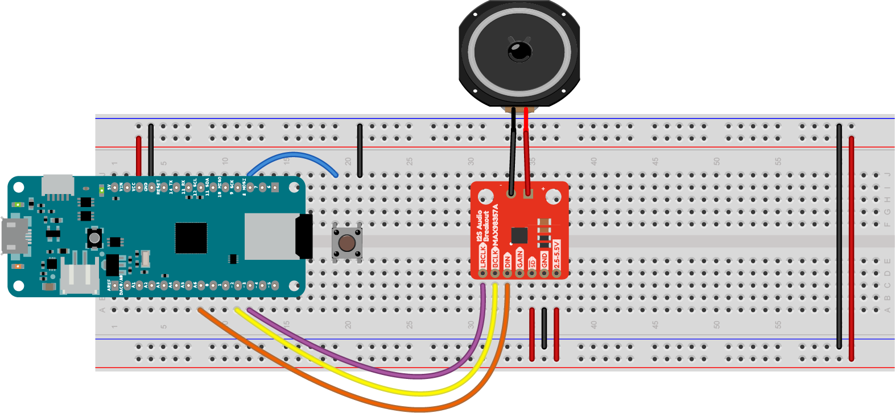

# Playback and Pausing of a .wav file using ArdunoSound Library

This example reads a wave file from an SD card and plays it using the I2S interface to an I2S Amp Breakout board. It's been tested with the UDA1334A and the MAX98357 amps.

The circuit below shows the wiring for the MAX98357 amp and a MKR Zero board. It can be used with other MKR boards and MKR-compatible boards if you attach an external SD card module or shield, and change the SD card SS pin accordingly.

*Figure 1. MAX98357 I2S audio amplifier connected to a MKR Zero. The board is shown rotated so that the top of the board is on the left side of the image. The amp is mounted on the breadboard below the MKR Zero, with the pins on the left side. The pins, numbered from top left, are: LRC; BCLK; DIN; GAIN; SD; GND; Vin.  The amp's pin 1 (LRC) is connected to the MKR Zero's digital pin 3 (physical pin 11). The amp's pin 2 (BCLK) is connected to the MKR Zero's digital pin 2 (physical pin 10). The amp's pin 3 (DIN) is connected to the MKR Zero's pin A6 (physical pin 8). The amp's pin 5 (SD, or shutdown) is connected to the 3.3V bus. The amp's pin 6 (GND) is connected to the ground bus and pin 7 (Vin) is connected to the 3.3V  bus. The pushbutton is connected to the MKR Zero's digital pin 7. The other pin is connected to ground.* 
