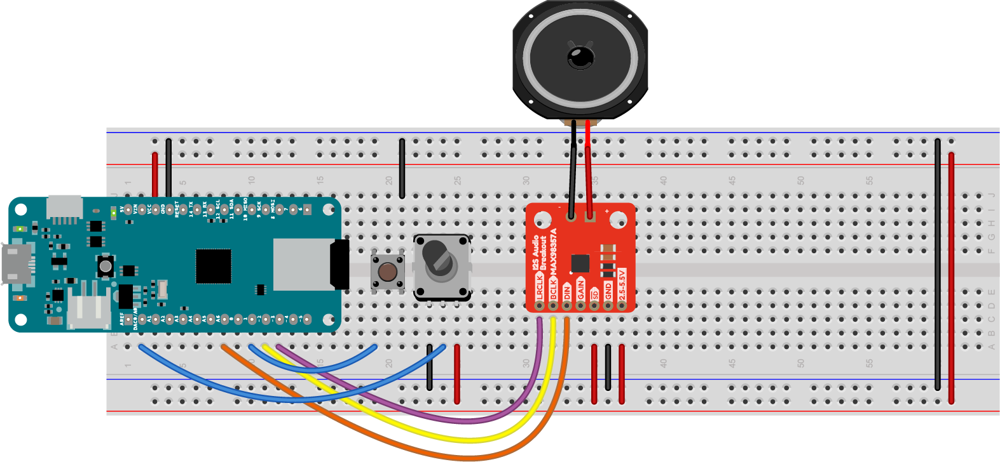

#  Payback of Multiple .wav Files Using the ArduinoSound Library

This reads a list of  .wav files from an SD card and plays the first one it using the I2S interface to an I2S Amp Breakout board. 

The sound files can be called anything you want, as long as they conform to 8.3 naming (8 characters in the name, 3 in the extension), and the extension is .WAV.

A pushbutton is connected to pin D7. The other side is connected to ground. Pressing it starts the next .wav file on the SD card. A potentiometer is attached to pins A0. It controls the volume of the sound.

*Figure 1. MAX98357 I2S audio amplifier connected to a MKR Zero. The board is shown rotated so that the top of the board is on the left side of the image. The amp is mounted on the breadboard below the MKR Zero, with the pins on the left side. The pins, numbered from top left, are: LRC; BCLK; DIN; GAIN; SD; GND; Vin.  The amp's pin 1 (LRC) is connected to the MKR Zero's digital pin 3 (physical pin 11). The amp's pin 2 (BCLK) is connected to the MKR Zero's digital pin 2 (physical pin 10). The amp's pin 3 (DIN) is connected to the MKR Zero's pin A6 (physical pin 8). The amp's pin 5 (SD, or shutdown) is connected to the 3.3V bus. The amp's pin 6 (GND) is connected to the ground bus and pin 7 (Vin) is connected to the 3.3V  bus. The potentiometer's center wiper pin is connected to the MKR Zero's pin A0. The two other pins are connected to the 3.3V bus and ground respectively. The pushbutton is connected to the MKR Zero's digital pin 7. The other pin is connected to ground.* 
