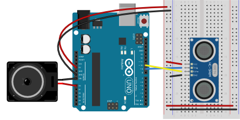

# HC-SR04 Ultrasonic Sensor Examples

All the examples in this section can be done with the same circuit diagram, below:

The examples cover the following concepts:

Concepts covered:

 ## [How to Read Distance With the Sensor](1_HC_SR04_ultrasonic_sensor/1_HC_SR04_ultrasonic_sensor.ino): 
* based on [these notes](https://itp.nyu.edu/physcomp/labs/lab-ultrasonic-distance-sensor/)
* How the ultrasonic sensor works
* Speed of sound
* conversion to centimeters
  

## [How to Convert Distance to Frequency](2_HC_SR04_ultrasonic_sensor_to_tone/2_HC_SR04_ultrasonic_sensor_to_tone.ino)
* based on these notes
* assume that the distance range that matters is 0 - 100cm
* Assume that the range of frequencies you want is 110Hz to  1046.5 Hz (A2 to C6 in equal tempered musical note pitches)
* Map the distance range to the frequency range
* Play the note (tone command) for 300 milliseconds
* Delay for 500 milliseconds to play the note and have a little rest

Now you've got a theremin

## [To Make The Device Not Play Continuously](3_HC_SR04_ultrasonic_sensor_to_note/3_HC_SR04_ultrasonic_sensor_to_note.ino) (optional)
* After playing a note, save the distance in a variable
* Before the next note, compare the new distance to the old distance
* If they're the same, don't play anything.

## [To Make The Device Convert To Specific Notes (Not All Frequencies In Between)](4_HC_SR04_ultrasonic_sensor_to_note_norepeat/4_HC_SR04_ultrasonic_sensor_to_note_norepeat.ino) (optional)
* Convert the distance to a MIDI note value
 * Convert the MIDI note value to a frequency
