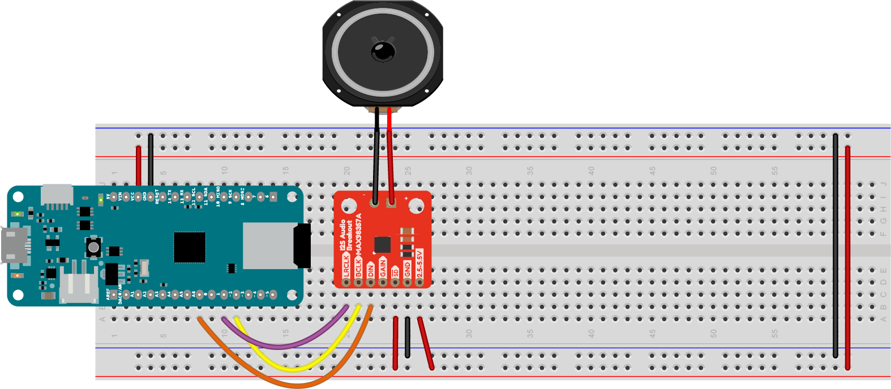
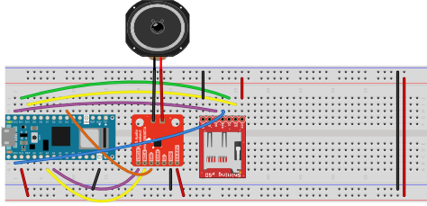
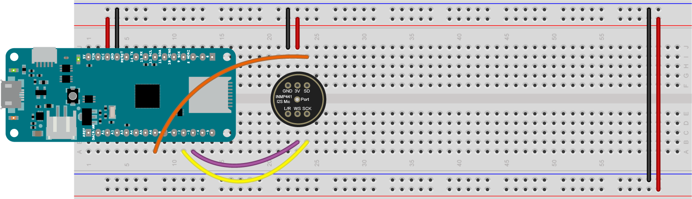
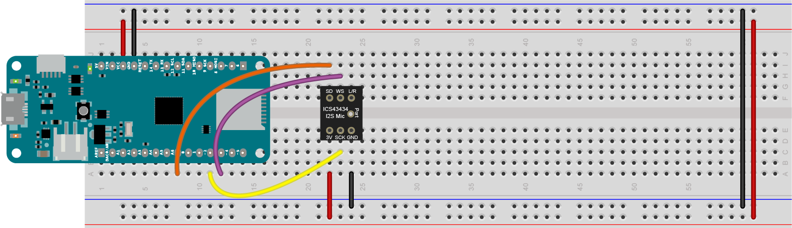
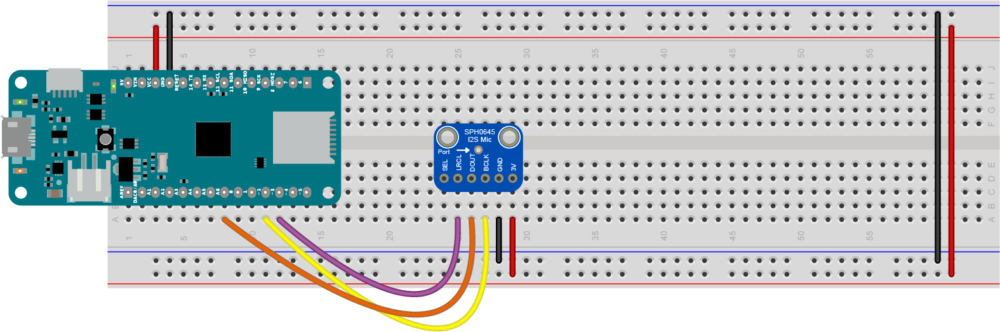

# The Inter-IC Sound (I2S) Protocol 

The *Inter-IC Sound protocol*, or *I2S*, is a protocol for tramsmitting digital audio from one device to another. It transfers pulse-code modulated (PCM) audio data, the standard for digital audio, from one integrated circuit (IC) to another. The standard was developed by Philips in the 1980's and 90's. 

I2S can be used to send pre-recorded audio files from a microcontroller to an amplifier or Digital-to-Analog converter (DAC). It can also be used to digitize audio from a microphone. There is no compression protocol in I2S itself, so you can't play MP3 or OGG files or other audio formats that compress the audio, but you can play WAV files. 

The MKR Zero, the Nano 33 IoT, and the other Arduino modules in the MKR family can communicate using I2S. In the examples that follow, you'll see how to use an I2S amplifier to play WAV files from an SD card, and how to analyze audio coming from an I2S microphone.  

## Examples

* [WAV file playback with potentiometer volume control](https://github.com/tigoe/SoundExamples/tree/master/ArduinoSound_Examples/WaveVolumeControl)
* [WAV file playback with encoder volume control](https://github.com/tigoe/SoundExamples/tree/master/ArduinoSound_Examples/WavePlaybackWithEncoder)
* [WAV file playback with pause/play control](https://github.com/tigoe/SoundExamples/tree/master/ArduinoSound_Examples/WavePlayPause)
* [Playback of multiple WAV files](https://github.com/tigoe/SoundExamples/tree/master/ArduinoSound_Examples/WavePlaybackMultipleFiles)
* [Sampler-style playback of multiple files](https://github.com/tigoe/SoundExamples/tree/master/ArduinoSound_Examples/WaveSamplePlayer)
* [Microphone input with pitch detection](https://github.com/tigoe/SoundExamples/tree/master/ArduinoSound_Examples/PitchDetector)

There are [additional examples available](https://www.arduino.cc/en/Reference/ArduinoSound) on the ArduinoSound Library page. 

## .WAV File Playback Considerations

If you plan to play .wav files using the ArduinoSound library using the examples here, The .wav file must be formatted as follows:stereo, signed 16-bit, 44100Hz. There's a [good tutorial on the Arduino site](https://www.arduino.cc/en/Tutorial/ArduinoSoundWavePlayback) on how to do this using the free audio editing software [Audacity](https://www.audacityteam.org/).

## SD Card Considerations

Your SD card needs to be formatted as FAT32 or FAT16. There are some instructions on the [Arduino site](https://www.arduino.cc/en/Reference/SDCardNotes) on formatting your card, as well as the [Adafruit site](https://forums.adafruit.com/viewtopic.php?f=31&t=7108%23p34846). If you're formatting on MacOS, you can use the DiskUtility app, but you must format your disk as MS-DOS (FAT).

## I2S Electrical Connections 

I2S is a synchronous serial bus protocol, meaning that you can connect multiple devices on the same common wires. The connections for an I2S bus are:

* Serial clock (SCK) or Bit Clock (BCLK): the line that carries the clock signal
* Frame Select (FS), also called Word Select (WS), or Left-Right Clock (LRC): determines left and right channels
* Data, also called Digital Out (DOUT) or Digital In (DIN) depending on the application: the data signal itself.

The controlling device sends the clock signal, just like in other synchronous serial protocols like I2C and SPI. For more on the technical details, see the [I2S specification](https://www.cypress.com/file/133906/download), as explained on Cypress' site. 

The Arduino [I2S](https://www.arduino.cc/en/Reference/I2S)  and the [ArduinoSound](https://www.arduino.cc/en/Reference/ArduinoSound) libraries support I2S. 

The typical connections are as follows:

* BCLK connects to pin D2 of the MKR board or A3 of the Nano 33 IoT board
* LRC connects to pin D3 of the MKR board or A2 of the Nano 33 IoT board
* DIN/DOUT connects to pin A6 of the MKR board or D4 of the Nano 33 IoT board

This wiring is shown in Figure 1 with a MSX98357 I2S audio amplifier. You can attach a speaker to this amp and play audio that you read from a MKR Zero's SD card, generated by the microcontroller's I2S output. Figure 2 shows the corresponding wiring for a Nano 33 IoT, which also needs an external SD card if you plan to play .WAV files. 

*Figure 1. MAX98357 I2S audio amplifier connected to a MKR Zero. The amp is mounted on the breadboard below the MKR Zero, with the pins on the left side. There are also two holes marked + and - on the right side of the board for a speaker. The pin connections are shown in Table 1.* 

### Table 1. MKR Zero to MAX98357 I2S Audio Amp Connections

| Amp Pin No. | Amp Pin function|  MKR Zero Pin No. | MKR Zero Pin Function |
|---|---|---|---|
| 1 | LRC | 10 | D2 |
| 2 | BCLK | 11 | D3 |
| 3 | DIN |  8 | A6 |
| 4 | GAIN | - | - | 
| 5 | SD | - | - | 
| 6 | GND | Ground bus | Ground |
| 7 | Vin | Voltage bus | Voltage |

*Figure 1. MAX98357 I2S audio amplifier connected to a Nano 33 IoT. The amp is mounted on the breadboard below the Nano 33 IoT, with the pins on the left side. A Sparkfun Level Shifting MicroSD card breakout board is mounted below the amp with the pins on the right side. The pin connections are shown in Tables 2 and 3. Note that the physical pin numbers for other MicroSD breakout boards might be different.*

### Table 2. Nano 33 IoT to MAX98357 I2S Audio Amp Connections

| Amp Pin No. | Amp Pin function|  Nano 33 IoT Pin No. | Nano 33 IoT  Pin Function |
|---|---|---|---|
| 1 | LRC | 7 | A3 |
| 2 | BCLK | 6 | A2 |
| 3 | DIN |  22 | D4 |
| 4 | GAIN | - | - | 
| 5 | SD | - | - | 
| 6 | GND | Ground bus | Ground |
| 7 | Vin | Voltage bus | Voltage |

### Table 3. Nano 33 IoT to Sparkfun Level Shifting MicroSD Card Connections

| MicroSD Pin No. | MicroSD Pin function|  Nano 33 IoT Pin No. | Nano 33 IoT  Pin Function |
|---|---|---|---|
| 1 | VCC | Voltage bus | Voltage | 
| 2 | CS | 28 | D10/CS |
| 3 | DI | 29 | D11/MOSI |
| 4 | SCK | 1 | D13/SCK | 
| 5 | DO | 30 | D12/MISO |
| 6 | CD | - | - |
| 7 | GND |  Ground bus | Ground |

Figure 3 shows a MKR Zero with a UDA1334 Digital-to-Analog (DAC) module, and Figures 4 through 6 with various I2S microphones. You'll see this wiring repeated the examples that follow.

The MAX98357 takes an I2S signal as input and outputs analog audio. The UDA1334 DAC module, shown in Figure 3, has no amp, but has a stereo mini jack that you can use to connect it to headphones or an amp. 

*Figure 3. UDA1334 I2S DAC connected to a MKR Zero. The DAC is mounted below the MKR Zero on the breadboard, with the audio jack pointed to the bottom of the breadboard, away from the MKR Zero. The DAC's pins, numbered in a U from top left, are: Vin; 3V out; GND; WSEL; DIN; BCLK; LOUT; AGND; ROUT; then on the right, from bottom right: DEEM; PLL; SF0; MUTE; SF1; SCLK. Table 4 details the pin connections between the DAC and the MKR Zero.*

### Table 4. MKR Zero to UDA1334 I2S DAC Connections

| DAC Pin No. | DAC Pin function|  MKR Zero Pin No. | MKR Zero Pin Function |
|---|---|---|---|
| 1 | Vin | Voltage Bus | Voltage |
| 2 | 3V out | - | - |
| 3 | GND |  Ground Bus | Ground |
| 4 | WSEL | 11 | D3 | 
| 5 | DIN | 8 | A6 | 
| 6 | BCLK | 10 | D2 |

The remainder of the DAC's pins are unconnected.

An I2C microphone generates an I2C signal from acoustic input. There are a few different I2S microphones on the market and they all appear to have slightly different sensitivities, though they all operate with the same code. Figure 4 shows the INMP441 mic, [available from various retailers on Amazon](https://www.amazon.com/gp/product/B07M9NFPFF/ref=ppx_yo_dt_b_asin_title_o07_s00?ie=UTF8&psc=1). Figure 5 shows the Invensense ICS43434, [available from Tindie](https://www.tindie.com/products/onehorse/ics43434-i2s-digital-microphone/). Figure 6 shows the SPH0645, [available from Adafruit](https://www.adafruit.com/product/3421).

*Figure 4. INMP441 I2S Mic connected to a MKR Zero. The Mic is mounted on the breadboard below the MKR Zero. The Mic's pins, numbered in a U pattern from top left, are: L/R select; WS; SCK; SD; 3V; GND. Table 5 details the pin connections.*

### Table 5. MKR Zero to INMP441 I2S Mic Connections

| Mic Pin No. | Mic Pin function|  MKR Zero Pin No. | MKR Zero Pin Function |
|---|---|---|---|
| 1 | L/R SEL | - | - |
| 2 | WS | 11 | D3 |
| 3 | SCK | 10 | D2 |
| 4 | SD | 8 | A6 | 
| 5 | 3V | Voltage Bus | Voltage |
| 6 | GND |  Ground Bus | Ground |

*Figure 5. ICS43434 I2S Mic connected to a MKR Zero. The Mic is mounted on the breadboard below the MKR Zero. The Mic's pins, numbered in a U pattern from top left, are: 3V; SCK; GND; L/R select; WS; SD. Table 6 details the pin connections.*

Pin 1 (3V) is connected to the 3.3V bus. Pin 2 of the mic (SCK) is connected to digital pin 2 on the MKR Zero (physical pin 11). Pin 3 of the mic (GND) is connected to the ground bus. Pin 5 of the mic (WS) is connected to pin 3 of the MKR Zero (physical pin 12). Pin 6 of the mic (SD) is connected to pin A6 of the Arduino (physical pin 8).*

### Table 6. MKR Zero to ICS43434 I2S Mic Connections

| Mic Pin No. | Mic Pin function|  MKR Zero Pin No. | MKR Zero Pin Function |
|---|---|---|---|
| 1 | 3V | Voltage Bus | Voltage |
| 2 | SCK | 10 | D2 |
| 3 | GND |  Ground Bus | Ground |
| 4 | L/R SEL | - | - |
| 5 | WS | 11 | D3 |
| 6 | SD | 8 | A6 | 

*Figure 6. SPH0645 I2S Mic connected to a MKR Zero. The Mic is mounted on the breadboard below the MKR Zero with the pins facing to the left. The Mic's pins, numbered from top to bottom, are: SEL; LRCL; DOUT; BCLK; GND; 3V. Table 7 details the connections.*

 Pin 2 of the mic (LRCL) is connected to pin 3 of the MKR Zero (physical pin 12). Pin 3 of the mic (DOUT) is connected to pin A6 of the Arduino (physical pin 8). Pin 4 of the mic (BCLK) is connected to digital pin 2 on the MKR Zero (physical pin 11). Pin 5 of the mic (GND) is connected to the ground bus. Pin 6 (3V) is connected to the 3.3V bus.*

### Table 7. MKR Zero to SPH0645 I2S Mic Connections

| Mic Pin No. | Mic Pin function|  MKR Zero Pin No. | MKR Zero Pin Function |
|---|---|---|---|
| 1 | L/R SEL | - | - |
| 2 | WS | 11 | D3 |
| 3 | SD | 8 | A6 | 
| 4 | SCK | 10 | D2 |
| 5 | GND |  Ground Bus | Ground |
| 6 | 3V | Voltage Bus | Voltage |