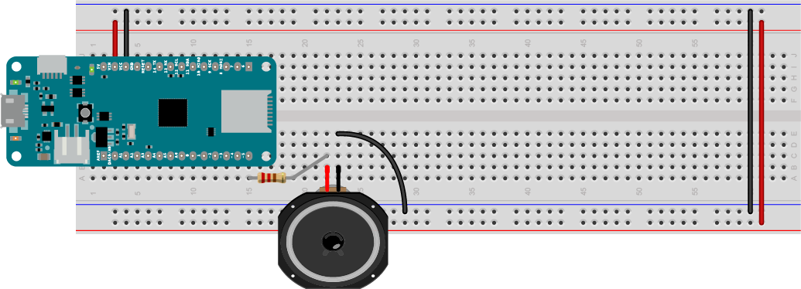

# Generating a Melody

Once you know how to [calculate the pitch for different notes](tone.md), you might want to play a song melody. This exercise introduces shows one way to do that. Although the tone() command can't play polyphonic melodies (i.e. multiple tones at once), it's useful for learning how to program simple sequences of notes. This same method can be used later when you want to generate more complex melodies on an external synthesizer too.

For all of the code in this exercise, you only need a speaker or headphone jack attached to your board, as shown in Figures 1 and 2:



*Figure 1. Speaker attached to pin 5 of a MKR Zero.*


*Figure 2. Headphone jack attached to pin 5 of a MKR Zero.*

## Elements of a Melody

At its simplest, a melody is a series of pitches played in a sequence over time. In order to play a melody, you need to know a few things:

* the sequence of pitches to be played
* the durations for each note
* the tempo at which to play them
* the time signature of the melody

The **tempo** of a melody is generally measured in beats per minute, and the **time signature** tells you how many beats per measure of music there will be, and what kind of note gets one beat. The most common time signature, 4/4 time (also called common time) has four beats per measure, and a quarter note gets one beat. A melody in common time simplifies things. 

Let's with a simple melody. Steve Reich's *[Piano Phase](https://www.scribd.com/doc/90735776/Piano-Phase-Steve-Reich)* is a minimalist duet for two pianos that's twelve notes long, Each note is a sixteenth note. The phrase repeated indefinitely on two pianos, with one shifting its tempo slightly to create phase shifting. It's written to be played at 72 beats per minute in common time. You can store the melody in an integer array.

<u style="color: green;">Syntax note:</u> an [**array**](https://www.arduino.cc/reference/en/language/variables/data-types/array/) is a variable that can hold multiple values of the same types. You use arrays when you need to store similar things, like the values of notes in a melody. 

Start your sketch by setting the refrence frequency and note number for A4 as usual, and a constant for the pin number:

````
#define NOTE_A4 69         // MIDI note value for middle A
#define FREQ_A4 440        // frequency for middle A

const int speakerPin = 5;  // the pin number for the speaker
````

Next, make an array of integers to store the note numbers of the melody, and a single integer variable to keep track of which note you are on:

````
// the melody sequence:
int melody[] = {64, 66, 71, 73, 74, 66, 64, 73, 71, 66, 74, 73};
// which note of the melody to play:
int noteCounter = 0;
````

Next you need to calculate the duration of each beat based on the tempo:

````
int bpm = 72;  // beats per minute
// duration of a beat in ms
float beatDuration = 60.0 / bpm * 1000;
````

In the loop, start by getting copying current note from the array. Then calculate the pitch using the same formula you used in the [pitch calculation exercise](tone.md):

````
void loop() {
  // current note is an element of the array:
  int currentNote = melody[noteCounter];
  // play a note from the melody:
  // convert MIDI note number to frequency:
  float frequency =  FREQ_A4 * pow(2, ((currentNote - NOTE_A4) / 12.0));
````

Next you need to calculate how long the note is. In common time, the standard beat is a quarter note, and all the notes in this melody are sixteenth notes. So you can just divide the beat duration by 4. Then play the tone and delay for the duration of the note:

````
 // all the notes in this are sixteenth notes,
  // which is 1/4 of a beat, so:
  int noteDuration = beatDuration / 4;
  // turn the note on:
  tone(speakerPin, frequency);
  // keep it on for the appropriate duration:
  delay(noteDuration);
  // turn the note off:
  noTone(speakerPins);
  ````

  Finally, add one to the note counter:

  ````
    // increment the note number for next time through the loop:
  noteCounter++;
  ````
  
  You want to keep the note counter no larger than the length of the melody, so you can use the[ **modulo** operator](https://www.arduino.cc/reference/en/language/structure/arithmetic-operators/remainder/) to do that. The modulo operation returns the remainder of the division of two numbers. So for example, 4 modulo 3 (written 4 % 3) is 1, because 4 divided by three has a remainder of one. The result of a modulo operation is always less than the second operand. So ``noteCounter % 12`` will always be within the count of notes in the melody. Finish the loop by using the modulo to keep the note counter in the range 0-12:

````
    // keep the note in the range from 0 - 12 using modulo:
  noteCounter = noteCounter % 12;
}
````

When you upload this sketch to your board, it will play the melody over and over indefinitely. 

Here is [the complete TonePianoPhase sketch](https://github.com/tigoe/SoundExamples/blob/master/Tone_examples/TonePianoPhase/TonePianoPhase.ino).

## A More Complex Melody: Calculating Note Lengths and Relative Pitches

Let's take slightly more complex melody, *Frere Jacques*. This melody has 32 notes, and is in common time at 120 beats per minute. The notes don't all have the same length though. So you could save this melody in two arrays, one for the melody and one for the rhythmic pattern. Each array will have 32 elements, so the sketch can iterate over them both at the same time.

What if you want to change the key in which you're playing the song? To do that, you need to know the relative pitches, rather than the absolute ones. In other words, you need to know how many semitones away from each other each note in the melody is. Then you can pick a starting note (called the **tonic** of the key you're in. Each key is named for its tonic) and move up and down from there with the melody. 

**[Musictheory.net](https://www.musictheory.net/lessons) has more useful information on [scales](https://www.musictheory.net/lessons/21) and [key signatures](https://www.musictheory.net/lessons/24).**

Figure 3 shows Frere Jacques in standard musical notation, in F.


*Figure 3.* Frere Jacques *in musical notation. credit: Wikipedia author Mysid - Own work; self-made in MuseScore.* 

Here's what the melody of Frere Jacques looks like in relative semitones. Each measure is given its own line to make it easier to read. The second array is the rhythms, where 1 = whole notes, 2 = half notes, and so forth:

````
// the melody sequence:
int melody[] = {1, 3, 5, 1,
                1, 3, 5, 1,
                5, 6, 8, 5, 6, 8,
                8, 10, 8, 6, 5, 1,
                8, 10, 8, 6, 5, 1,
                1, -4, 1,
                1, -4, 1
               };
// the rhythm sequence:
int rhythm[] = {4, 4, 4, 4,
                4, 4, 4, 4,
                4, 4, 2,
                4, 4, 2,
                8, 8, 8, 8, 4, 4,
                8, 8, 8, 8, 4, 4,
                4, 4, 2,
                4, 4, 2
               };
````
*Note: if you're confused because you've seen this song written out before as "1,2,3,1,1,2,3,1,3,4,5... " etc, it's because those pitches are whole tones, not semitones.*

With that information, you're ready to write the sketch to play it. Start, as usual, by setting the refrence frequency and note number for A4 as usual, and a constant for the pin number. Then add the score, both melody and rhythm, and the noteCounter. Add a variable for the melody length too. Then calculate the beats per minute from the tempo:

````
#define NOTE_A4 69         // MIDI note value for middle A
#define FREQ_A4 440        // frequency for middle A

const int speakerPin = 5;  // the pin number for the speaker

// the melody sequence:
int melody[] = {1, 3, 5, 1,
                1, 3, 5, 1,
                5, 6, 8, 5, 6, 8,
                8, 10, 8, 6, 5, 1,
                8, 10, 8, 6, 5, 1,
                1, -4, 1,
                1, -4, 1
               };
// the rhythm sequence:
int rhythm[] = {4, 4, 4, 4,
                4, 4, 4, 4,
                4, 4, 2,
                4, 4, 2,
                8, 8, 8, 8, 4, 4,
                8, 8, 8, 8, 4, 4,
                4, 4, 2,
                4, 4, 2
               };
// which note of the melody to play:
int noteCounter = 0;
// the length of the melody:
int melodyLength = 32;

int bpm = 120;  // beats per minute
// duration of a beat in ms
float beatDuration = 60.0 / bpm * 1000;
````
Next, set the tonic. This is will set the key you're in. F4 is MIDI note 65, so let's use that:

````
int tonic = 65; // the tonic sets the key you're in
````
Your setup function configures the speaker pin as an output as usual:

````
void setup() {
  // make the speaker pin an output:
  pinMode(speakerPin, OUTPUT);
}
````

The beginning of the loop is a bit more complext this time. After you get the note value from the melody array, you have to add the tonic to it before you calculate the pitch:

````
void loop() {
  // current note is an element of the array:
  int currentNote = melody[noteCounter] + tonic;
  // play a note from the melody:
  // convert MIDI note number to frequency:
  float frequency =  FREQ_A4 * pow(2, ((currentNote - NOTE_A4) / 12.0));
  ````

Next you need to calculate the note duration using the type of note it is. Since the tempo is based on quarter notes, one quarter note is one beat duration. So the formula is as follows: 

````
   // calculate noteDuration from the note type:
  float noteDuration = beatDuration * (4.0 / rhythm[noteCounter]);
````

With this tune, perhaps you want it more [staccato](https://musicterms.artopium.com/s/Staccato.htm) than the previous one. This means you need a bit more space between the notes. So play each note for only 85% of the duration, like so:

````
  // turn the note on:
  tone(speakerPin, frequency, noteDuration * 0.85);
  // keep it on for the appropriate duration:
  delay(noteDuration);
  // turn the note off:
  noTone(speakerPin);
````

If you don't like that level of separation, change the percentage in the code above. Note thst the ``tone()`` command will only play the note for whatever percentage of the note duration you give it.

Finally, increment the note counter, and make sure it stays within the melody length like you did before:

````
  // increment the note number for next time through the loop:
  noteCounter++;
  // keep the note in the range from 0 - melodyLength using modulo:
  noteCounter = noteCounter % melodyLength;
}
````

That's your whole sketch. Upload it and listen to the melody. Does it sound like *Frere Jacques*? 

Try changing the tonic, the playing it again. Notice how the tune is still recognizable, because you used relative pitches in the melody array. You can change the key and the tempo of this song fairly easily because of how you used relative pitch and standard note lengths. 

Here is [the complete ToneFrereJacques sketch](https://github.com/tigoe/SoundExamples/blob/master/Tone_examples/ToneFrereJacques/ToneFrereJacques.ino).

Of course, if you know this song, you know it's normally sung in a round, so you're probably eager to reprogram it to do so. Remember, you can't play more than one tone at a time on the Arduino using the ``tone()`` command, so you'll need to know a bit more first. If you're really eager, pick up a second Arduino and a second speaker and get them singing together!