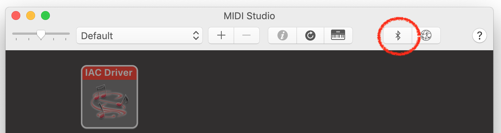
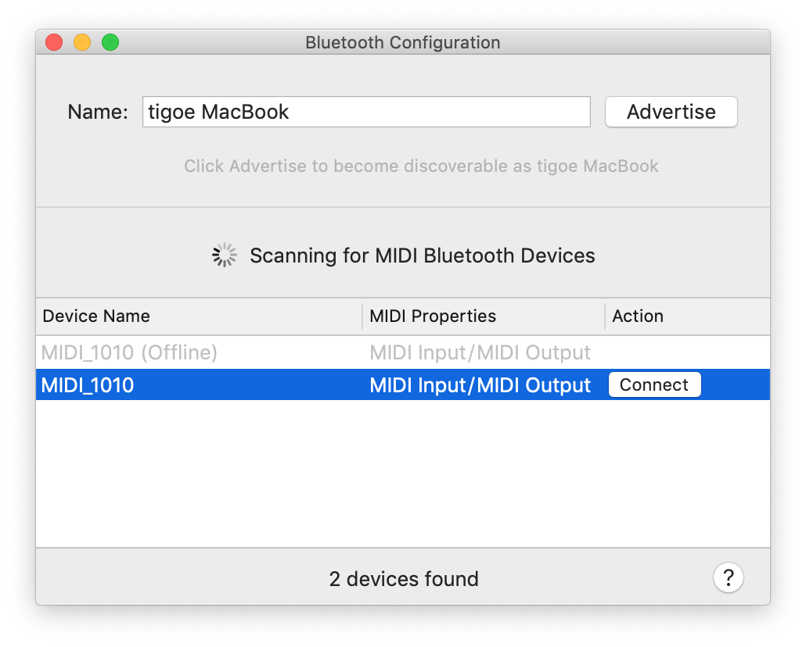

#  MIDI over Bluetooth LE

Some newer MIDI devices, and most personal computers, can send and receive MIDI over Bluetooth LE. MIDI over Bluetooth is included in MacOS and Android, and has recently been included in [Windows 10](https://blogs.windows.com/buildingapps/2016/09/21/midi-enhancements-in-windows-10/#ggWxAYzWRQ4WCEVg.97) as well. The MKR 1010 and the Nano 33 IoT boards can communicate using Bluetooth LE. Presumably you can do it with some of the Arduino derivatives which communicate using Bluetooth LE as well, but these examples have only been tested with the [ArduinoBLE library](https://github.com/arduino-libraries/ArduinoBLE) on the MKR 1010 and Nano 33 IoT.

## ArduinoBLE Library
In order to use these examples you'll need to include the ArduinoBLE library for use on the MKR 1010 and Nano 33 BLE. In the Arduino IDE, click on the Sketch Menu, then choose Include Library... then Manage Libraries. This will open the Library Manager. Filter for ArduinBLE, and you should see a library called "ArduinoBLE by Arduino". Install it. Then you're ready to start.

## Brief Introduction to Bluetooth LE Concepts

*For more on Bluetooth LE, see [Make: Bluetooth](https://www.amazon.com/Make-Bluetooth-Projects-Raspberry-Smartphones/dp/1457187094) by Alasdair Allan, Don Coleman, and Sandeep Mistry, or this set of [Bluetooth LE notes](https://github.com/tigoe/BLEDocs).* 

The Bluetooth radio protocol is made up of several application profiles: Audio, File Transfer, and so forth. In earlier versions, there was also a Serial Port Profile, which would enable a virtual serial port over Bluetooth. As of version 4.0 (also known as Bluetooth Low Energy or Bluteooth LE), the protocol underwent some changes. The serial port profile is no longer part of the protocol. Instead, Bluetooth LE uses a publish-and-subscribe model, in which some devices publish services and others subscribe to those services. 

Bluetooth LE devices are separated into two classes: central devices and peripheral devices. **Peripheral devices**, like a fitness device, smart tag, or MIDI controller, offer data services which  can be read by other devices. **Central devices**, like a laptop computer or mobile phone or tablet, subscribe to and read services from peripheral devices.  When a central device connects to a peripheral, it browses the available services and can then read, write, or subscribe to changes in the service. 

A peripheral's **services** are collections of information. For example, a peripheral with an joystick attached might offer a joystick service which includes the data coming from the joystick itself. Every service is made up of **characteristics**. The joystick might have an X characteristic, a Y movement characteristic, and a pushbutton characteristic, for example. Each characteristic has a specific **value**, which can change. The pushbutton might change from 0 to 1. for example. 

Characteristics can have different properties. They can be readable by a central, writable by a central, or subscribable. When a central subscribes to a characterstic, it's automatically notified when the value changes.

Every device, service, and characteristic in Bluetooth LE gets assigned a Universally Unique Identifier, or **UUID** number.  A UUID is a 128-bit number that's associated with some data element. They're used in many protocols. If you want to generate your own UUIDs, [UUIDgenerator.net](https://www.uuidgenerator.net/) makes it simple. 

[Bluetooth LE MIDI](https://www.midi.org/specifications/item/bluetooth-le-midi), originally developed by Apple, is a new part of the MIDI specification. In short, it wraps MIDI messages in a Bluetooth LE characteristic. 

## Bluetooth LE MIDI Setup

To set up Bluetooth LE MIDI on a MKR 1010 or Nano 33 IoT using the ArduinoBLE library, there are a few steps you need to do. First, include the ArduinBLE library at the beginning of your code. Next, make an array of MIDI data and make variables for the BLE MIDI service and message characteristic:

````
#include <ArduinoBLE.h>

byte midiData[] = {0x80, 0x80, 0x00, 0x00, 0x00};

// set up the MIDI service and MIDI message characteristic:
BLEService midiService("03B80E5A-EDE8-4B33-A751-6CE34EC4C700");
BLECharacteristic midiCharacteristic("7772E5DB-3868-4112-A1A9-F2669D106BF3",
                                     BLEWrite | BLEWriteWithoutResponse |
                                     BLENotify | BLERead, sizeof(midiData));

````
You'll notice that the service and characteristics both have UUIDs. These numbers are specific to MIDI BLE, and can't be changed. The ``midiData`` array is used to make a Bluetooth data packet in the characteristic. The first two bytes will never change, but the last three will be the three bytes of your MIDI message. 

Next, in the ``setup()``, you need to start the BLE radio using ``BLE.begin()``, then set the local name of the device. This can be anything you like. Then set the MIDI service as the advertised service, and add the message characteristic to the service. Finally, start advertising the service. 

````
void setup() {
  // initialize serial communication
  Serial.begin(9600);
  // initialize built in LED:
  pinMode(LED_BUILTIN, OUTPUT);
  // Initialize BLE:
  if (!BLE.begin()) {
    Serial.println("starting BLE failed!");
    while (true);
  }
  // set local name and advertised service for BLE:
  BLE.setLocalName("MIDI_1010");
  BLE.setAdvertisedService(midiService);

  // add the characteristic and service:
  midiService.addCharacteristic(midiCharacteristic);
  BLE.addService(midiService);

  // start advertising
  BLE.advertise();
}
````

In your ``loop()`` function, you'll wait for central devices to connect, and when they do, you'll take action. You can write to your characteristic, and in this case, so can the central, since the characteristic is writable. 

As you've done in the other MIDI exercises, you should make a MIDICommand() function. This is where you'll actually change the characteristic, with new MIDI values. 

 Now that you know the basic steps of a MIDI BLE application, let's see them in action. Here, you'll duplicate the simple MIDI player that you made in the other MIDI exercises.

## Simple MIDI Player

Let's start with a simple MIDI melody player. We'll use the Steve Reich *Piano Phase* melody that you used in the [melody exercise](melody.md).  Start a new sketch just as you saw in the last section, by including the ArduinoBLE library, and setting up the midiData array and the service and characteristic you'll need. 

The song will be at 72bpm, and the melody will be the same as it was in the melody exercise, so add the following to your global variables after the BLE variables:

````
int bpm = 72;  // beats per minute
// duration of a beat in ms
float beatDuration = 60.0 / bpm * 1000;

// the melody sequence:
int melody[] = {64, 66, 71, 73, 74, 66, 64, 73, 71, 66, 74, 73};
// which note of the melody to play:
int noteCounter = 0;
````

In the ``setup()``, initialize MIDI BLE exactly as you saw in the previous section. 

In the `loop()` function, you'll wait for a central device to connect. When it does, you'll turn on the builtin LED to indicate the connection.
````
  // wait for a BLE central
  BLEDevice central = BLE.central();

  // if a central is connected to the peripheral:
  if (central) {
    // turn on LED to indicate connection:
    digitalWrite(LED_BUILTIN, HIGH);
````
NExt you'll send a MIDI command to play a note on channel 0 (that's MIDI command 0x90) at full volume (that's 127, or 0x7F in hexadecimal). You'll write the ``midiCommand()`` function later, but with this information, you can write the call to the function:

````
    // play a note from the melody:
    midiCommand(0x90, melody[noteCounter], 127);
````
All the notes in this melody are sixteenth notes, which is 1/4 of a beat, so delay that long. Then send a note off command (0x80) for the same pitch:

````
 // all the notes in this are sixteenth notes,
  // which is 1/4 of a beat, so:
  int noteDuration = beatDuration / 4;
  // keep it on for the appropriate duration:
  delay(noteDuration);
  // turn the note off:
  midiCommand(0x80, melody[noteCounter], 0);
  ````
  Finally, add one to the note counter, then make sure it's no larger than the length of the melody (12 notes). That'll closes out the ``if (central) {`` block. After that you can turn off the builtin LED because the central is disconnected, and you can close the ``loop()`` function:

  ````
    // increment the note number for next time through the loop:
    noteCounter++;
    // keep the note in the range from 0 - 11 using modulo:
    noteCounter = noteCounter % 12;
  }
  // when the central disconnects, turn off the LED:
  digitalWrite(LED_BUILTIN, LOW);
}
````

Now you need to write the `midiCommand()` function that you've called in the loop. It looks like this:

````

// send a 3-byte midi message
void midiCommand(byte cmd, byte data1, byte  data2) {
  // MIDI data goes in the last three bytes of the midiData array:
  midiData[2] = cmd;
  midiData[3] = data1;
  midiData[4] = data2;

  midiCharacteristic.setValue(midiData, sizeof(midiData));
}
````

When you upload this, it will send out MIDI notes over and over. You can see that all you're doing is updating the last three bytes of the characteristic with your MIDI data. The rest is handled by the central when it receives your data. 

Here is [the complete sketch](https://github.com/tigoe/SoundExamples/blob/master/MIDI_examples/ArduinoBLEMIDI/ArduinoBLEMIDI.ino).

## Connecting The Controller to a Software Synth

You can connect via BLE to a MacOS computer using the Audio MIDI Setup application which is included with the operating system. Open it and look for the Bluetooth icon. Figure 1 shows the panel with the icon highlighted. 



*Figure 1. MacOS Audio MIDI Studio panel, showing the Bluetooth button*

When you click the Bluetooth Icon the Bluetooth scanner will open up. If the above sketch is uploaded, the  Arduino should show up as a new MIDI device, as shown in Figure 2. Click "connect" and the device will be available to all your MIDI applications. 



*Figure 2. MacOS Audio MIDI Bluetooth Configuration panel. Your BLE device should show up in the list at the bottom, and you can connect to it by pressing the Connect button.*

Even though your device is sending out MIDI, no one's listening. If you have a Digital Audio Workstation like Ableton or GarageBand, then you can open it, configure the MIDI input to look for your Arduino, and the notes will play. For more on that, see this [MIDI to DAW tutorial](https://itp.nyu.edu/physcomp/labs/labs-serial-communication/lab-arduino-to-daw/). If you're not using a DAW, download a free MIDI synth player like [Sforzando](https://www.plogue.com/products/sforzando.html). You might want the [Sforzando users guide](https://s3.amazonaws.com/sforzando/sforzando_guide.pdf) as well. Then download an instrument file. This [Yamaha Disklavier grand piano](http://freepats.zenvoid.org/Piano/acoustic-grand-piano.html) is pretty good, as are some of the other SoundFonts on that page. 

Launch Sforzando. The first time you launch it, it should prompt you to set your MIDI input preferences. Choose your Arduino as a MIDI input. Unzip the sound files, then click Import in Sforzando to open the SoundFont files.  Then you should hear the melody playing. Congratulations, you've got MIDI! 

Now you're ready to go on to [making a MIDI instrument](midi-instrument.md).

**Note:** you can also connect Android software synths to your controller using the [MIDI BLE Connect app](https://play.google.com/store/apps/details?id=com.mobileer.example.midibtlepairing) which you can download from the Android app store. 