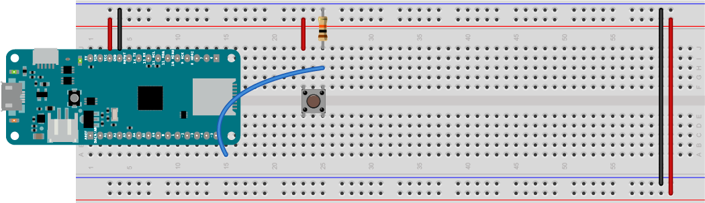

## Making A MIDI Instrument

Playng pre-recorded MIDI melodies is only so much fun, but making MIDI instruments with sensors as input is a lot more fun. This exercise contains a couple of simple MIDI instruments to get you started.

## The Circuit

This instrument will be the simplest input you can make: a single pushbutton. Connect a pushbutton to pin 5 of your microcontroller as follows: Connect one side of the pushbutton directly to pin 5. Connect the other side of the pushbutton to the voltage output (Vcc) of your microcontroller. Then connect a 10-kilohm resistor (with the brown, black, orange, and gold bands) from the junction between pin 5 and the pushbutton to ground. Figure 1 below shows how to connect it. 



*Figure 1. Pushbutton attached to pin 5 of a MKR Zero. This is a common configuration for a [pushbutton as a digital input](https://itp.nyu.edu/physcomp/labs/labs-arduino-digital-and-analog/digital-input-and-output-with-an-arduino/) and you'll use it a lot. The resistor is called a pulldown resistor. It provides a connection to ground for the input when the pushbutton is open.*

##  A Digital Input Sketch
 
Now, write a sketch to read the pushbutton. When you press the pushbutton, a high voltage (the level of Vcc, or +3.3V) will be connected to the input. When you release it, the input will be connected to ground through the resistor.  The command to read a digital input is `digitalRead()`. When the input is a high voltage, `digitalRead()` will return a value of 1, and when the input's connected to ground, it will return a value of 0. 

To use a digital I/O pin as an input, you first have to configure it as an input using the pinMode() command. You usually do this in the `setup()` function like so:

````
void setup() {
  pinMode(5, INPUT);
  // initialize serial output:
  Serial.begin(9600);
}
````

Then in the loop() function, you read the input like so:

````
void loop() {
  int buttonState = digitalRead(5);
  Serial.println(buttonState);
}
````

Upload this sketch, then open the Serial Monitor (the magnifying glass in  the top right corner, or control-shift-M (Windows) or command-shift-M (MacOS)). You should see 0's scrolling down the page until you press the pushbutton, then 1's when you press it. When you've got that, you've got a working digital input. When you're ready, program it to read only when the button changes its state.

## Digital Input State Change

What you really need to know in order to send MIDI note on and note off messages is not just what the state of the pushbutton is, but when it changes from off to on. This is called *state change detection* and to do it, you need to know the current state of the input, then compare it to the previous state. You'll need a global variable for the previous button state:

````
int lastButtonState = 0;

void setup() {
  pinMode(5, INPUT);
  // initialize serial output:
  Serial.begin(9600);
}
````

Then in the loop, read the button and compare the two. If they're not equal (that's what `!=` means) then the button has changed. It's either gone from on to off, or off to on (on is also referred to as HIGH because the voltage is high, and off is LOW):

````
void loop() {
  int buttonState = digitalRead(5);
  if (buttonState != lastButtonState) {
      if (buttonState == HIGH) {
          Serial.println("the button is pressed");
      } else {
      if (buttonState == HIGH) {
          Serial.println("the button is released");
      }
    // save the current state as the previous state 
    // for the next comparison:
    lastButtonState = buttonState; 
  }
````

Try this sketch out. You may notice that sometimes you get a false reading. The pushbutton may wiggle a little as you press, changing from off to on rapidly. You can fix this with a little `debounce delay`. Add a `delay(5);` after the comparison like so: 

````
  if (buttonState != lastButtonState) {
      delay(5);
      if (buttonState == HIGH) {
````

The debounce delay gives the button a few milliseconds to settle into place before checking if it's high or low, and stabilizes the reading. When this is working, it's time to make some MIDI. 

## Send MIDI Messages on the State Change

Now you can send some MIDI. After the `loop()` function, add in the `midiCommand()` function that you wrote in the [MIDIUSB](midiusb.md) exercise:

````
// send a 3-byte midi message
void midiCommand(byte cmd, byte data1, byte  data2) {
  // First parameter is the event type (top 4 bits of the command byte).
  // Second parameter is command byte combined with the channel.
  // Third parameter is the first data byte
  // Fourth parameter second data byte

  midiEventPacket_t midiMsg = {cmd >> 4, cmd, data1, data2};
  MidiUSB.sendMIDI(midiMsg);
````

Make sure to include the MIDIUSB library at the top of your sketch as well:

````
#include <MIDIUSB.h>
````

Now, in the loop, replace the `Serial.println()` commands with calls to `midiCommand()` like so:

````
void loop() {
  int buttonState = digitalRead(5);
  if (buttonState != lastButtonState) {
      if (buttonState == HIGH) {
           // play middle A, full loudness:
          midiCommand(0x90, 0x45, 0x7F);
      } else {
      if (buttonState == HIGH) {
          // turn off middle A:
          midiCommand(0x80, 0x45, 0);
      }
    // save the current state as the previous state 
    // for the next comparison:
    lastButtonState = buttonState; 
  }
  ````

  Start up your MIDI synth application, and press the button. You should hear middle A playing whenever you press the button.  Here is [the complete sketch](MIDI_examples/tree/master/MIDIUSB_oneKeyPiano/MIDIUSB_oneKeyPiano.ino).