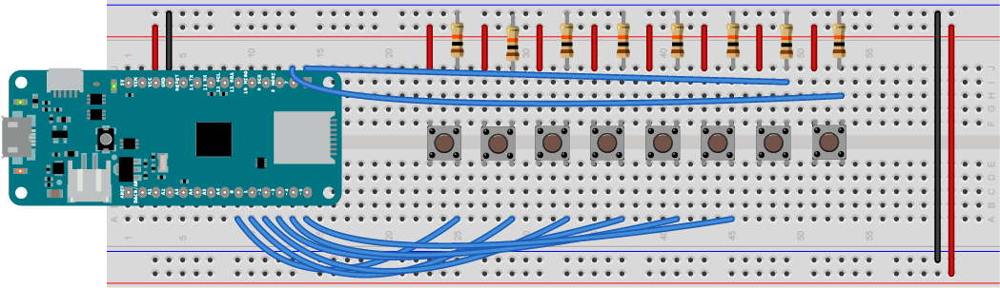

## Making A MIDI Instrument

Playng pre-recorded MIDI melodies is only so much fun, but making MIDI instruments with sensors as input is a lot more fun. This exercise contains a couple of simple MIDI instruments to get you started.

## The Circuit

This instrument will be the simplest input you can make: a single pushbutton. Follow the [breadboard setup instructions](setup.md#breadboard-setup) in the setup exercise. Then connect a pushbutton to pin 5 of your microcontroller as follows: Connect one side of the pushbutton directly to pin 5. Connect the other side of the pushbutton to the voltage bus of your breadboard. Then connect a 10-kilohm resistor (with the brown, black, orange, and gold bands) from ground to the junction row connecting pin 5 and the pushbutton. Figure 1 below shows how to connect it. 


*Figure 1. Pushbutton attached to pin 5 of a MKR Zero. This is a common configuration for a [pushbutton as a digital input](https://itp.nyu.edu/physcomp/labs/labs-arduino-digital-and-analog/digital-input-and-output-with-an-arduino/) and you'll use it a lot. The resistor is called a pulldown resistor. It provides a connection to ground for the input when the pushbutton is open.*

##  A Digital Input Sketch
 
Now, write a sketch to read the pushbutton. When you press the pushbutton, a high voltage (in this case Vcc, or +3.3V) will be connected to the input. When you release it, the input will be connected to ground through the resistor.  The command to read a digital input is `digitalRead()`. When the input is a high voltage, `digitalRead()` will return a value of 1, and when the input's connected to ground, it will return a value of 0. 

To use a digital I/O pin as an input, you first have to configure it as an input using the ``pinMode()`` command. You usually do this in the `setup()` function like so:

````
void setup() {
  pinMode(5, INPUT);
  // initialize serial output:
  Serial.begin(9600);
}
````

Then in the ``loop()`` function, you read the input like so:

````
void loop() {
  int buttonState = digitalRead(5);
  Serial.println(buttonState);
}
````

Upload this sketch, then open the Serial Monitor (the magnifying glass in  the top right corner, or control-shift-M (Windows) or command-shift-M (MacOS)). You should see 0's scrolling down the page until you press the pushbutton, then 1's when you press it. When you've got that, you've got a working digital input. When you're ready, program it to read only when the button changes its state.

## Digital Input State Change

What you really need to know in order to send MIDI note on and note off messages is not just what the state of the pushbutton is, but when it changes from off to on. This is called **state change detection**. To do it, you need to know the current state of the input, then compare it to the previous state. You'll need a global variable to keep track of the previous button state:

````
int lastButtonState = 0;

void setup() {
  pinMode(5, INPUT);
  // initialize serial output:
  Serial.begin(9600);
}
````

Then in the loop, read the button into a variable called ``buttonState`` and compare it to ``lastButtonState``. If they're not equal (that's what `!=` means) then the button has changed. It's either gone from on to off, or off to on (on is also referred to as ``HIGH`` because the voltage is high, and off is ``LOW``):

````
void loop() {
  int buttonState = digitalRead(5);
  if (buttonState != lastButtonState) {
      if (buttonState == HIGH) {
          Serial.println("the button is pressed");
      } else {
      if (buttonState == HIGH) {
          Serial.println("the button is released");
      }
    // save the current state as the previous state 
    // for the next comparison:
    lastButtonState = buttonState; 
  }
````

Try this sketch out. You may notice that sometimes you get a false reading. The pushbutton may wiggle a little as you press, changing from off to on rapidly. You can fix this with a little **debounce delay**. Add a `delay(5);` after the comparison like so: 

````
  if (buttonState != lastButtonState) {
      delay(5);
      if (buttonState == HIGH) {
````

The debounce delay gives the button a few milliseconds to settle into place before checking if it's high or low, and stabilizes the reading. When this is working, it's time to make some MIDI. 

## Send MIDI Messages on the State Change

After the `loop()` function, add in the `midiCommand()` function that you wrote in the [MIDIUSB](midiusb.md) exercise:

````
// send a 3-byte midi message
void midiCommand(byte cmd, byte data1, byte  data2) {
  // First parameter is the event type (top 4 bits of the command byte).
  // Second parameter is command byte combined with the channel.
  // Third parameter is the first data byte
  // Fourth parameter second data byte

  midiEventPacket_t midiMsg = {cmd >> 4, cmd, data1, data2};
  MidiUSB.sendMIDI(midiMsg);
````

Make sure to include the MIDIUSB library at the top of your sketch as well:

````
#include <MIDIUSB.h>
````

Now, in the loop, replace the `Serial.println()` commands with calls to `midiCommand()` like so:

````
void loop() {
  int buttonState = digitalRead(5);
  if (buttonState != lastButtonState) {
      if (buttonState == HIGH) {
           // play middle A, full loudness:
          midiCommand(0x90, 0x45, 0x7F);
      } else {
      if (buttonState == HIGH) {
          // turn off middle A:
          midiCommand(0x80, 0x45, 0);
      }
    // save the current state as the previous state 
    // for the next comparison:
    lastButtonState = buttonState; 
  }
  ````

  Start up your MIDI synth application, and press the button. You should hear middle A playing whenever you press the button.  Here is [the complete sketch](https://github.com/tigoe/SoundExamples/blob/master/MIDI_examples/MIDIUSB_oneKeyPiano/MIDIUSB_oneKeyPiano.ino).

  ## Improvise in a Particular Scale

  Playing the same note is not so exciting, but even with one button, you can make an instrument that can improvise, by randomizing the note value. Try adding a global variable called noteValue before the setup:

````
int noteValue = 0;
````

Then in the loop, add in the following line right before you send the note on message, and change the value of the note in the note on and note off `midiCommand()` calls:

````
void loop() {
  int buttonState = digitalRead(5);
  if (buttonState != lastButtonState) {
      if (buttonState == HIGH) {
        noteValue = random(88) + 14;
        midiCommand(0x90, noteValue, 0x7F);
      } else {
      if (buttonState == HIGH) {
          // turn off the note:
          midiCommand(0x80, noteValue, 0);
      }
    // save the current state as the previous state 
    // for the next comparison:
    lastButtonState = buttonState; 
  }
  ````

  Upload the sketch and press the button a few times. It sounds atonal, but you are playing random notes when you press, and turning then off. 

  If you want to constrain the improv to a given scale, you need to generate a scale. How about a major scale?  [The pattern of notes in any major scale](https://www.musictheory.net/lessons/21) is:

  whole whole half whole whole whole half

  Armed with that, you can write a scale randomizer. Start a whole new sketch, as follows:

  ````
#include <MIDIUSB.h>
#include <pitchToNote.h>

// the intervals in a major and natural minor scale:
int major[] = {2, 2, 1, 2, 2, 2, 1};

// an array to hold the final notes of the scale:
int scale[8];

// start with middle C:
int tonic = pitchC4;
// note to play:
int noteValue = tonic;

// previous state of the button:
int lastButtonState = LOW;

  ````

  Then in the ``setup()``, you need to take the list of intervals for a major scale and the tonic note you want, and generate a scale by adding the whole or half steps in sequence:

  ````
  void setup() {
    pinMode(5, INPUT);
    // fill the scale array with the scale you want:
    // start with the initial note:
    scale[0] = tonic;
    int note = scale[0];
    // iterate over the intervals, adding each to the next note
    // in the scale:
    for (int n = 0; n < 7; n++) {
        note = note + major[n];
        scale[n+1] = note;
    }
}
  ````

  Now you've got a major scale. If you want to change from C major to another major scale, just change the tonic to another value, Try `pitchE4b` for E-flat. If you want a [natural minor scale](https://www.musictheory.net/lessons/22), try the following instead of the `major[]` array:

  ````
  int naturalMinor[] = {2, 1, 2, 2, 1, 2, 2};
  ````

Now copy the state change detector that ou wrote for the pushbutton, but add in the randomizer to pick from the `scale[]` array like so:

````

void loop() {
  // read the pushbutton:
  int buttonState = digitalRead(5);
  // compare its state to the previous state:
  if (buttonState != lastButtonState) {
    // debounce delay:
    delay(5);
    // if the button's changed and it's pressed:
    if (buttonState == HIGH) {
      // pick a random note in the scale:
      noteValue = scale[random(8)];
      // play it:
      midiCommand(0x90, noteValue, 0x7F);
    } else  {
      // turn the note off:
      midiCommand(0x80, noteValue, 0);
    }
    // save the button state for comparison next time through:
    lastButtonState = buttonState;
  }
}
````

Finally, add the `midiCommand()` function from above. Then upload the sketch and press the button. You should hear random notes, all in the same scale. You're improvising a solo now! [ Here's the complete sketch](https://github.com/tigoe/SoundExamples/blob/master/MIDI_examples/MIDIUSB_oneKey_improviser/MIDIUSB_oneKey_improviser.ino).

## Other Instruments

You can build many other instruments by combining analog and digital inputs and changes in programming like this.  The principle behind them all is the same:

1. read sensors
2. determine when something important has happened (like a state change, or an analog sensor crossing a threshold)
3. Generate a MIDI message from the sensor event

### Eight-Key Keyboard
Here's an example that uses [eight pushbuttons to generate a piano](https://github.com/tigoe/SoundExamples/blob/master/MIDI_examples/MIDIUSBJoystick/MIDIUSBJoystick.ino). The eight pushbuttons are attached to pins 0 though 7 just as the one shown above. The pushbutton is connected to +Vcc on one side, and to the pin on the other, with a 10-kilohm pulldown resistor from the pin to ground on each one. 



*Figure 2. Eight pushbuttons attached to pins 0-7 of a MKR Zero. This uses the same digital input configuration as Figure 1 above.*

### Joystick Pitch Bender
Here's another [example that uses a joystick to generate and bend the pitch of a note](https://github.com/tigoe/SoundExamples/blob/master/MIDI_examples/MIDIUSBJoystick/MIDIUSBJoystick.ino). A joystick has a built-in pushbutton and two potentiometers. This example uses the pushbutton to start or stop a note, and the joystick to generate a pitch bend on the note. ***Pitch bend** is a controller type in MIDI that lets you bend a note up or down from its original pitch. The joystick's X axis pin is attached to pin A0 of the MKR Zero. The pushbutton pin, marked SEL, is attached to pin 5.  Note that the pushbutton does not have a pulldown resistor because it is using the Arduino's internal pullup resistor. In this case, the pinMode is `INPUT_PULLUP`, and pressed is LOW and unpressed is HIGH. 


*Figure  3. Joystick attached to pins 5 and A0 of a MKR Zero. The pushbutton does not have a pulldown resistor because it is using the Arduino's internal pullup resistor.*

### Make Your Own Instrument
You can make all kinds of musical instruments with MIDI by combining pushbuttons and analog sensors like joysticks, potentiometers, and other control sensors. Here's a basic plan:

* First, decide on what physical controls you'll use. 
* Second, decide what MIDI property each control will control: note on and off? Pitch bend? Instrument selection? Volume?
* Third, decide what change in the control makes something happen: state change of a button? Analog sensor crossing a threshold? Continuous change?
* Fourth, write a program that reads that change and prints out a message to the Serial Monitor as a test
* Finally, replace the Serial messages with a function to generate a MIDI command as you saw above.

