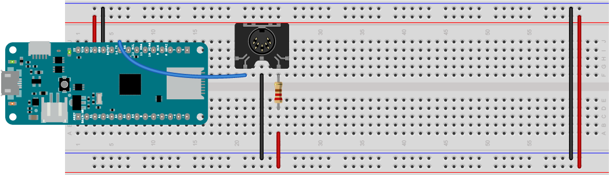
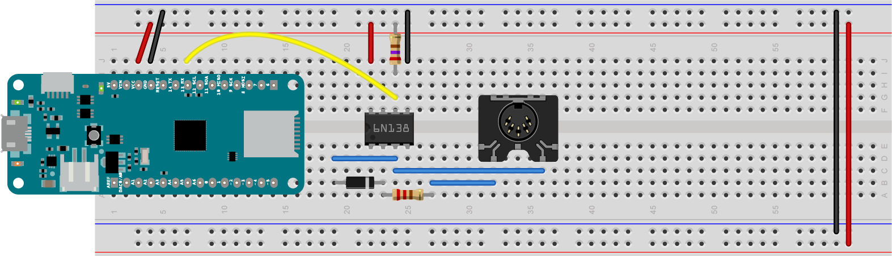
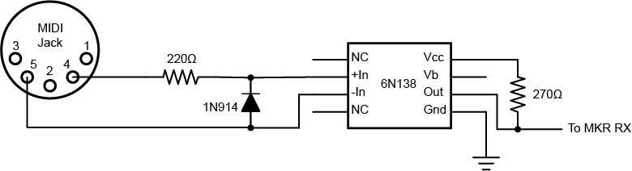

# MIDI Serial

MIDI is an asynchronous serial data protocol, and most MIDI controllers and synthesizers do not have USB ports. The standard MIDI connector is a 5-pin connector that looks like the one shown in Figure 1 below. The controller sends data using asynchronous serial communication over this connector, and the receiving sound module (e.g. synthesizer, sampler or other output device) reads that data and interprets the commands to make sound. 

## MIDI Sound Modules
To make this exercise work, you'll need a sound module that has MIDI input and analog audio output. Sound modules can range from low-priced modules like the [MIDIPlus S-engine](https://www.amazon.com/S-Engine-USB-MIDI-Sound-Module/dp/B01E5GGKE4) to mid-priced modules like the [Roland D-05](https://www.amazon.com/Roland-D-05-Sound-Module/dp/B075H7FTK4/) to high-end modules like the [Access Virus T12 Desktop](https://www.amazon.com/Access-TI2-DESKTOP-Virus-Desktop/dp/B002V4NC76/). Since the MIDI protocol hasn't changed much since the 1980's, you can still find used older models (aka "vintage synths") that still are compatible with modern controllers, and deliver satisfying sounds, like the [Alesis NanoSynth](http://www.vintagesynth.com/misc/nanosynth.php).

There are several good guides to buying sound modules. [HearTheMusicPlay.com](https://hearthemusicplay.com/best-keyboard-and-midi-sound-modules/) has a good one, linked here. [MusicRadar](https://www.musicradar.com/news/the-best-hardware-synthesizers-2018-keyboards-modules-and-portable-synths) has another good guide for higher-end modules. 

## Serial Output

<u style="color: green;">Hardware note:</u> These MIDI serial examples will work on any Arduino, with some modification. Boards that have two hardware serial ports, like the MKR boards, Mega, Leonardo, Micro, and Yún, can use Serial1 to send serial data to a MIDI playback device like a synthesizer or sampler. Serial1 is connected to a second asynchronous serial UART on these boards. (see the [setup page](setup.md) for more on asynchronous serial) Boards that don't have two hardware serial ports, like the Uno, can use the SoftwareSerial library to communicate with MIDI playback devices.

### Hardware Serial Output

The circuit you'll use for this approach is shown in Figure 1 below. Follow the [breadboard setup instructions](setup.md#breadboard-setup) in the setup exercise.  Then connect the MIDI jack as shown here. The MIDI jack has 5 connectors arranged in a semi-circle. They are numbered, from left to right, 3,5,2,4,1 (don't ask why). The center pin (pin 3) of the MIDI connector is connected to ground. With the connector facing you the second pin from the left  (pin 5) is connected to the Arduno's serial transmit pin, labeled TX, through a 220-ohm resistor. On the MKR boards, this is the sixth pin from the top on the right side of the board. On a Leonardo or Yún, it's digital pin 1, the second from the bottom on the right. The MIDI jack's fourth pin from the left (pin 4) is connected to voltage through a 220-ohm resistor. The MIDI jack's center pin is connected to ground.



*Figure 1. MIDI serial output connection to a 5-pin MIDI connector*

### For the Uno: MIDI SoftwareSerial

The Uno does not have a second UART serial port, so you'll need to use the SoftwareSerial library to send MIDI from it. Connect the MIDI jack as described in Figure 1, but connect the serial pin to pin 3 on the Uno.


Once you've connected the MIDI output connector,  use a MIDI connector to connect to the MIDI in connector on your sound module.  

## Simple MIDI Player

Let's start with a simple MIDI melody player. We'll use the Steve Reich *Piano Phase* melody that you used in the [melody exercise](melody.md) and in the [MIDIUSB exercise](midiusb.md). 

The song will be at 72bpm, and the melody will be the same as it was in the melody exercise, so your global variables will look like this:

````
int bpm = 72;  // beats per minute
// duration of a beat in ms
float beatDuration = 60.0 / bpm * 1000;

// the melody sequence:
int melody[] = {64, 66, 71, 73, 74, 66, 64, 73, 71, 66, 74, 73};
// which note of the melody to play:
int noteCounter = 0;
````

In the ``setup()`` function, you need to initialize serial communication on Serial1, the TX and RX pins, like so: 

````
void setup() {
  // initialize MIDI serial:
  Serial1.begin(31250);
}
````

In the `loop()` function, you'll send a MIDI command to play a note on channel 0 (that's MIDI command 0x90) at full volume (that's 127, or 0x7F in hexadecimal). You'll write the function later, but with that information, you can write the call to the function:

````
void loop() {
  // play a note from the melody:
  midiCommand(0x90, melody[noteCounter], 0x7F);
````
All the notes in this melody are sixteenth notes, which is 1/4 of a beat, so delay that long. Then send a note off command (0x80) for the same pitch:

````
 // all the notes in this are sixteenth notes,
  // which is 1/4 of a beat, so:
  int noteDuration = beatDuration / 4;
  // keep it on for the appropriate duration:
  delay(noteDuration);
  // turn the note off:
  midiCommand(0x80, melody[noteCounter], 0);
  ````

  Finally, add one to the note counter, then make sure it's no larger than the length of the melody (12 notes). That'll be the end of the `loop()` function:

  ````
    // increment the note number for next time through the loop:
  noteCounter++;
  // keep the note in the range from 0 - 11 using modulo:
  noteCounter = noteCounter % 12;
}
````
Now you need to write the `midiCommand()` function that you've called in the loop. It looks like this:

````

// send a 3-byte midi message
void midiCommand(byte cmd, byte data1, byte  data2) {
  Serial1.write(cmd);     // command byte (should be > 127)
  Serial1.write(data1);   // data byte 1 (should be < 128)
  Serial1.write(data2);   // data byte 2 (should be < 128)
}
````
When you upload this, it will send out MIDI notes over and over. 

When you connect your MIDI output to the MIDI in of a MIDI sound module, and the module's audio out to an amp and speakers, this sketch should play the tune. Congratulations, you've got MIDI! Here is [the complete sketch for Serial1](https://github.com/tigoe/SoundExamples/blob/master/MIDI_examples/Serial1_MIDI_simple/Serial1_MIDI_simple.ino).

And here's the complete sketch for [SoftwareSerial](https://github.com/tigoe/SoundExamples/blob/master/MIDI_examples/SoftwareSerial_MIDI_simple/SoftwareSerial_MIDI_simple.ino). 

Now you're ready to go on to [making a MIDI instrument](midi-instrument.md).

## Things to Remember

If you're using the MIDIUSB library, there are just a few things you'll want to remember as you build other examples:

### Open the Serial Connection

Every Serial MIDI sketch will initialize MIDI serial communication. If you're using one of the boards with two hardware Serial ports, you'll do the following in your ``setup()`` function:

````
 // initialize MIDI serial:
  Serial1.begin(31250);
````

If you're using SoftwareSerial library,  first you'll include the SoftwareSerial library at the beginning of your code and initialize the SoftwareSerial connection and set the transmit  (TX) and receive (RX) pins: 

````
#include <SoftwareSerial.h>

SoftwareSerial midiSerial(2, 3); // 2 is RX, 3 is TX

````

Then you'll initialize it in your ``setup()`` function like so:

````
  // initialize software MIDI serial:
  midiSerial.begin(31250);
````

### Make Notes with a MIDI Command Function

Most MIDI commands are three bytes, a command byte followed by two data bytes. So the `MidiCommand()` function you wrote here should work for most MIDI note-playing applications:

For Serial1 it will look like this:
````
// send a 3-byte midi message
void midiCommand(byte cmd, byte data1, byte  data2) {
  Serial1.write(cmd);     // command byte (should be > 127)
  Serial1.write(data1);   // data byte 1 (should be < 128)
  Serial1.write(data2);   // data byte 2 (should be < 128)
}
````
And for SoftwareSerial, it will look like this:

````
// send a 3-byte midi message
void midiCommand(byte cmd, byte data1, byte  data2) {
  midiSerial.write(cmd);     // command byte (should be > 127)
  midiSerial.write(data1);   // data byte 1 (should be < 128)
  midiSerial.write(data2);   // data byte 2 (should be < 128)
}
````

## Serial Input

Serial input is not as common a project, because the Arduino boards are better as controllers than as sound modules. But you can read MIDI into an Arduino if you need to. Figure 2 shows the MIDI input circuit. The MIDI jack is connected to the microcontroller through an optoisolator. An **optoisolatator** has an LED on the input side and a phototransistor on the output side, so that the two sides of the circuit are electrically isolated from each other, for extra safety.

The parts for this are:
* 1 MIDI 5-pin connector
* 1 6N138 optoisolator
* 1 1N915 diode
* 1 270-ohm resistor
* 1 220-ohm resistor
* wires

In Figure 2, the optoisolator straddles the center of the breadboard a few rows below the MKR Zero board. It's an 8-pin component with pins on either side, spaced 0.1 inches apart (this is called a **DIP package**). The pins are numbered in a U-fashion with 1 on the top left, 4 on the bottom left, 5 on the bottom right, and 8 on the top right. The optoisolator's pin 8 (top right) is connected to voltage, and pin 5 (bottom right) is connected to ground. a 270-ohm resistor connects pin 6 to voltage as well. A wire connects the MKR Zero's RX pin (seventh from the top right) to the optoisolator's pin 6 as well. The cathode of a 1N914 diode is connected to the optoisolator's pin 3. The anode of the diode is connected to pin 2. A 220-ohm resistor connects pin 2 to the MIDI connector's fourth pin from the left (pin 4). The MIDI connector's second pin from the left (pin 5) is connected to the optoisolator's pin 3. Figure 2a shows the same connections in a schematic diagram. 
 


*Figure 2. MIDI serial input connection to a 5-pin MIDI connector through an optoisolator*



*Figure 2a. MIDI serial input schematic.*

Example: [Serial1_MidiRead_Raw](https://github.com/tigoe/SoundExamples/blob/master/MIDI_examples/Serial1_MidiRead_Raw/Serial1_MidiRead_Raw.ino)

Example: [MIDILibrary_MIDI_In](https://github.com/tigoe/SoundExamples/blob/master/MIDI_examples/MIDILibrary_MIDI_In/MIDILibrary_MIDI_In.ino) (Note: this requires the [MIDI library from FortySevenEffects](https://github.com/FortySevenEffects/arduino_midi_library). Follow their steps for installation)