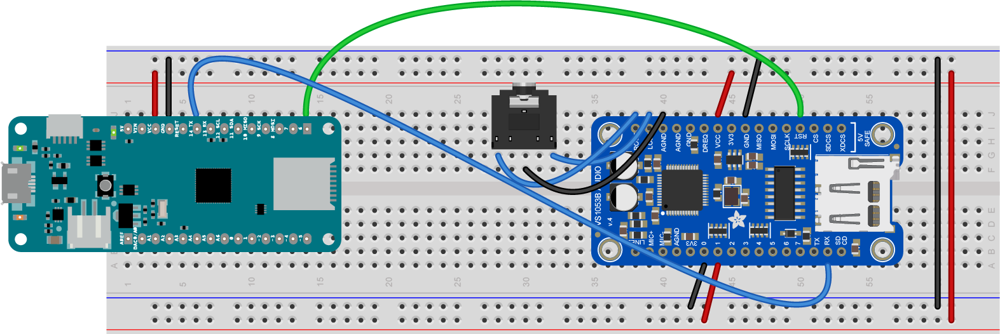

# MIDI On The VS1053 Module


There are some synthesizer modules available that connect directly to a microcontroller on a breadboard. [VSLI's VS1053 MP3 decoder and MIDI synthesizer](http://www.vlsi.fi/en/products/vs1053.html) is a good example.  Sparkfun and Adafruit both make breakout boards or Arduino shields for this component, such as Sparkfun's MP3 Player shield or Musical Instrument shield, or Adafruit's VS1053 Codec & MicroSD card module or Music Maker shield or VS1053 Headphone Featherwing. 

Controlling a MIDI synth module like this one is essentially the same as the other MIDI serial examples. The only difference is that you'll need to control the synth module's reset pin as well.  

Figure 1 shows the circuit for connecting to Adafruit's VS1053 Codec & MicroSD card module in MIDI mode. For this circuit you'll need a 3.5mm stereo mini headphone hack as well. The VS1053's SD card points to the bottom of the module. The pins are numbered in a U-shape from top left to bottom left (1-16), then from bottom right to top right (17-32). The connections are as follows:
* MKR TX pin (physical pin 15) to VS1053 RX pin (physical pin 15)
* MKR digital pin 6 (physical pin 14) to VS1053 reset pin (physical pin 20)
* VS1053 R out (physical pin 32) to right pin of a 3.5mm stereo mini jack
* VS1053 L out (physical pin 31) to left pin of a 3.5mm stereo mini jack
* VS1052 AGND (physical pin 30) to the center pin of a stereo mini jack
* VS1053 Vcc (physical pin 26) to Voltage bus
* VS1053 ground (physical pin 24) to ground bus
* VS1053 GPIO0 (physical pin 6) to ground bus
* VS1053 GPIO1 (physical pin 7) to voltage bus



*Figure 1. MKR board connected to an Adafruit VS1053 module in MIDI mode*


## Simple MIDI Player

As you did with the other MIDI examples, start by writing a simple MIDI melody player. We'll use the Steve Reich *Piano Phase* melody that you used in the [melody exercise](melody.md) and in the [MIDIUSB exercise](midiusb.md). 

At the top of your code, set a constant with the pin for the VS1053's reset pin:

````
const int VS1053_RESET = 6;    // reset pin for the VS1053
````

The song will be at 72bpm, and the melody will be the same as it was in the melody exercise, so your global variables will look like this:

````
int bpm = 72;  // beats per minute
// duration of a beat in ms
float beatDuration = 60.0 / bpm * 1000;

// the melody sequence:
int melody[] = {64, 66, 71, 73, 74, 66, 64, 73, 71, 66, 74, 73};
// which note of the melody to play:
int noteCounter = 0;
````

In the ``setup()`` function, you need to initialize serial communication on Serial1, the TX and RX pins, as you did with [MIDI serial exercise](midi-serial.md). You also need to reset the VS1053 module by taking its reset pin low and then high: 

````
oid setup() {
  // initialize MIDI serial:
  Serial1.begin(31250);

  // reset the VS1053 by taking reset low, then high:
  pinMode(VS1053_RESET, OUTPUT);
  digitalWrite(VS1053_RESET, LOW);
  delay(10);
  digitalWrite(VS1053_RESET, HIGH);
}
````

The rest of the sketch will look just like the [MIDI Serial exercise](midi-serial.md).

In the `loop()` function, you'll send a MIDI command to play a note on channel 0 (that's MIDI command 0x90) at full volume (that's 127, or 0x7F in hexadecimal). You'll write the function later, but with that information, you can write the call to the function:

````
void loop() {
  // play a note from the melody:
  midiCommand(0x90, melody[noteCounter], 0x7F);
````
All the notes in this melody are sixteenth notes, which is 1/4 of a beat, so delay that long. Then send a note off command (0x80) for the same pitch:

````
 // all the notes in this are sixteenth notes,
  // which is 1/4 of a beat, so:
  int noteDuration = beatDuration / 4;
  // keep it on for the appropriate duration:
  delay(noteDuration);
  // turn the note off:
  midiCommand(0x80, melody[noteCounter], 0);
  ````

  Finally, add one to the note counter, then make sure it's no larger than the length of the melody (12 notes). That'll be the end of the `loop()` function:

  ````
    // increment the note number for next time through the loop:
  noteCounter++;
  // keep the note in the range from 0 - 11 using modulo:
  noteCounter = noteCounter % 12;
}
````
Now you need to write the `midiCommand()` function that you've called in the loop. It looks like this:

````

// send a 3-byte midi message
void midiCommand(byte cmd, byte data1, byte  data2) {
  Serial1.write(cmd);     // command byte (should be > 127)
  Serial1.write(data1);   // data byte 1 (should be < 128)
  Serial1.write(data2);   // data byte 2 (should be < 128)
}
````
When you upload this, it will send out MIDI notes over and over. 

When you connect a speaker or headphones to the stereo mini jack, you should hear _Piano Phase_ playing on the MIDI piano synth on the module. Here is [the complete sketch](https://github.com/tigoe/SoundExamples/blob/master/VS1053_examples/VS1053_MIDI_simple/VS1053_MIDI_simple.ino).

Now you're ready to go on to [making a MIDI instrument](midi-instrument.md).

## Things to Remember

The only difference between VS1053 MIDI sketches and MIDI serial sketches is the need to reset the module in the `setup()`. Otherwise, remember the [things to remember about MIDI serial](midi-serial.md#things-to-remember), and you're set for software. 

On the hardware side, the thing most people forget is to connect the two I/O pins on the VS1053 to voltage and ground, respectively. These pins define whether the module is set up to play MIDI or to play an MP3 file.

