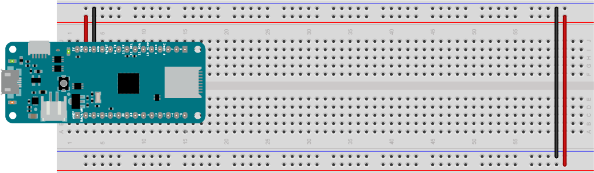

# Setting Up To Build Projects

All of the projects in these examples will need a similar setup. 

## Install the Arduino IDE, Board Definitions, and Libraries

First you'll need the Arduino programming application (called an Integraded Development Environment, or IDE) [Download the Arduino IDE](https://www.arduino.cc/en/Main/Software) for your personal computer and install it. AS of this writing, the current version is 1.8.8. You can use either the downloaded IDE or the web editor but the instructions here will all be for the downloaded version. 

If you're brand new to Arduino, you may want to read through a longer guide like [*Getting Started with Arduino*, 3rd edtion](https://www.makershed.com/products/make-getting-started-with-arduino-3rd-edition) by Massimo Banzi and Michael Shiloh.

Once you've downloaded the IDE, check out the [Getting Started Guide for Arduino](https://www.arduino.cc/en/Guide/HomePage) and the [guide for the MKRZero](https://www.arduino.cc/en/Guide/ArduinoMKRZero) or the [guide for the MKR Wifi 1010](https://www.arduino.cc/en/Guide/MKRWiFi1010). 

For both boards, you'll need to open the Tools menu, then Boards Manager, then filter your search for MKR. You'll see a package called Arduino SAMD Boards (32-bits ARM Cortex-M0+) by Arduino. Click Install. When it's installed you can close the Boards Manager.

Next, Click on the Sketch Menu, choose Include Library... then Manage Libraries. filter your search for ArduinoSound and install it. Then filter your search for MIDIUSB and install it. You'll use these libraries in many of these examples.

When you write your first Arduino program (called a **sketch**), the IDE will save it, and all your other sketches, in a folder called Arduino in your Documents folder, unless you specify otherwise. 

That's enough to get your IDE set up. Now let's move on to the solderless breadboard.


## Set Up the Breadboard

The solderless breadboard holds your microcontroller and other components, and lets you connect them together using jumper wires. The two long rows of holes down either side of the board are connected vertically. They're called **buses**, and usually the red one is called the **voltage bus** or **power bus**, and the blue or black one is called the **ground bus**. You need connections to voltage and ground for every circuit you build, and the buses make it easy to set those up. The short rows of holes in the center of board are connected horizontally to each other with a break in the middle. These are where you connect components. 

Figures 1 and 2 below show what's underneath the holes,and how they are connected. 


*Figure 1. How the holes of a breadboard are connected*


*Figure 2. The back of the breadboard, showing  the metal strips connecting the holes*

The MKR Zero and MKR WiFi 1010 both have the same layout of input and output pins and power and ground pins, so you can use the same basic wiring for both. The USB connector is at the top of the board. The voltage and ground pins are on the right hand side. The analog input pins are on the left hand side towards the top, and the digital input and output pins are on the bottom left and along the right hand side. Figure 3 below shows the MKR pin layout, and the tables on either side of it list the pin functions, top to bottom on each side. 

### MKR Pin Layout
<table>
<tr>
<th>Left side pins</th>
<th></th>
<th>Right side pins</th>
</tr>
<tr>
<td style="vertical-align: top;">A0/DAC0<br />
A1<br />
A2<br />
A3<br />
A4<br />
A5<br />
A6<br />
D0<br />
D1<br />
D2 (PWM)<br />
D3 (PWM)<br />
D4 (PWM)<br />
D5 (PWM)<br /></td>
<td style="vertical-align: top;"><br />
<em>Figure 3. MKR Zero</em>
</td>
<td style="vertical-align: top;">Vcc - 3.3V<br />
Vin - voltage in, 5V max.<br />
Ground<br />
reset<br />
D14 and Serial1 TX<br />
D13 and Serial1 RX<br />
D12 and I2C SCL<br />
D11 and I2C SDA<br />
D10 and SPI MISO<br />
D9 and SPI SCK<br />
D8 and SPI MOSI<br />
D7<br />
D6 and built-in LED<br /></td>
</tr>
</table>

The pins you'll use all the time are the third from the top on the right, Vcc, which outputs 3.3 volts when the board is connected to a USB power source or a battery,and the fourth from top on the right GND, which is the ground pin. Remember, voltage is always a relative measurement between two points. The Vcc pin's voltage is measured relative to ground.

Plug your MKR into your breadboard with the top pins in the top row of the board. Connect the GND pin on the right side to the right side ground bus and the VCC pin to the voltage bus. Then connect the bus rows on the right side to their corresponding buses on the left. Figure 4 shows the board connected this way. The figure is rotated counter-clockwise so that the right hand side bus is on the top. Most of the circuit diagrams in these examples will be shown this way.



*Figure 4. MKR Zero on a breadoard with Vcc and GND connected to the voltage and ground bus rows. The bus rows are also wired to their counterparts on the opposite side*

## Upload an Arduino Program

The first Arduino Arduino program, or sketch, that most people write is called Blink. It blinks an LED on the board. There's a built-in LED on the MKR boards attached to pin 6. But since these are sound examples, let's start with an example that makes noise. Attach one end of a 220-ohm resistor to the same row as pin 5 of the MKR board, and the other end to one of the other short rows of the breadboard. Then attach an 8-ohm speaker to that same row, as shown in Figure 5. 


*Figure 5. Speaker attached to pin 5 of a MKR Zero. The resistor limits the current to the speaker to protect it.*

Now, type the following code into the Arduino IDE.Save this sketch with the name ``ToneSimple``:

````
void setup() {
  // make the speaker pin an output:
  pinMode(5, OUTPUT);
}

void loop() {
  // turn the speaker on at 440Hz:
  tone(5, 440);
  delay(500);
  // turn the speaker off:
  noTone(5);
  delay(500);
}
````

Now plug your board into a USB port of your personal computer. Next, click on the Tools menu, then choose Board, then Arduino MKRZERO.  Click the Tools menu again, choose Port, then look for a port with the subtitle ``(Arduino MKRZERO)``. On Windows, it will be called ``COM3`` or a higher number. On MacOS, it may be called ``/cu/usbmodem1411`` or another number. Finally, compile upload the sketch to your board by clicking the Sketch menu and choosing Upload. You can also do this by typing ctrl-U (command-U on MacOS), or clicking the Upload button on the editor window toolbar. Figure 6 shows the toolbar, with the upload button highlighted.


*Figure 6. The Upload button is the second from left on the toolbar*

Once you upload the sketch, your speaker should start playing a note at middle A (440 Hertz) every half second. Now you know everything is working properly. You should also see the following text in the error console at the bottom of the editor window:

````
Verify 10952 bytes of flash with checksum.
Verify successful
done in 0.010 seconds
CPU reset.
````

## Programming Syntax: Parts of an Arduino Sketch

Now that you've got your sketch wotking, it's worth reviewing some of the elements of it for future use.

The Arduino programming environment uses the C programming language and the grammatical style, or **syntax**, comes from C. Every line in a C program ends with a semicolon. Double slashes (//) indicate that the rest of the line should be ignored, so you can use them to make comments for yourself in your code. YOu can make multi-line comments in between /* and */ markers. 

Every programming language needs places in memory to store information. These are called variables, and though you didn't use any here, you'll see them a lot in the future. C requires that you initialize every variable with a variable type, such as an integer (type ``int``) or a floating-point decimal number (type ``float``). Even nothing is a type, called ``void``.

There are two **functions** in the sketch, called ``setup()`` and ``loop()``. Functions are sets of instructions. Sometimes they return a value when they complete. The setup function runs once when the Arduino is reset. The loop runs continuously. When it finishes running, it starts again. It runs as long as the Arduino is powered.  You'll write other functions later, and you'll use them by putting their names in your program. 

Functions have a value type that they return. Both of these functions return nothing, so their type is ``void``. Later you might see functions that return integer numbers. Their type would be ``int``. Functions also have ``parameters``. Parameters are what you fill in in the parentheses. If the function name is a verb, then the parameters are the direct objects, adjectives, and adverbs of a function. For example, [``tone()`` is a function](https://www.arduino.cc/reference/en/language/functions/advanced-io/tone/) (built-in functions are sometimes also called commands), and it has two parameters: the pin number that you want to write to, and the frequency that you want to give the pin. So ``tone(5, 440);`` sets pin 5 changing 440 times a second. The [``delay()`` function](https://www.arduino.cc/reference/en/language/functions/time/delay/) stops the program for an amount of time, and its parameter is the number of milliseconds that you want to stop for. So ``delay(500);`` stops program for 500/1000 of a second, or half a second. 

Blocks of code that are all dependent on the same conditions are set off by braces like this {}. For example, all the code inside a function is dependent on you calling the function. So the syntax for a function needs a function type a name, parentheses for parameters, and braces to hold the code inside it, like so:

````
void loop() {
  
}
````

Here's an [overview of programming terms and environments](https://itp.nyu.edu/physcomp/lessons/programming/programming-terms-and-programming-environments/) that will familiarize you with the IDE and the terms you'll encounter a bit more. 

The collection of functions of any programming environment are called the **Application Programming Interface (API)**. The [Arduino API reference pages](https://www.arduino.cc/reference/en/) can be found online, and can also be accessed from the IDE's Help menu. There are lots of built-in programming examples in the File menu as well.

If you've made it this far, then you're all ready to try the rest of the examples here. You might want to read a little about [variables in programming languages](https://itp.nyu.edu/physcomp/lessons/programming/variables/), since you'll be using them a lot. 

Next, move on to the [sound basics page](sound-basics.md) for some background on how sound is produced.