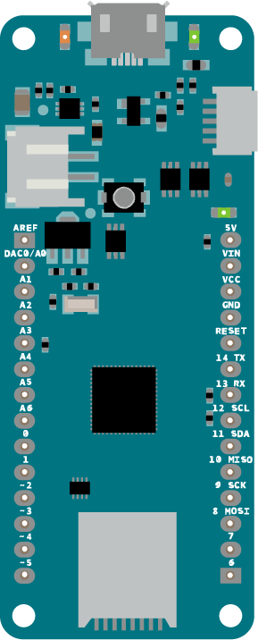

# Setting Up To Build Projects

All of the projects in these examples will need a similar setup. 

## Install the Arduino IDE, Board Definitions, and Libraries

First you'll need the Arduino programming application (called an Integraded Development Environment, or IDE) [Download the Arduino IDE](https://www.arduino.cc/en/Main/Software) for your personal computer and install it. AS of this writing, the current version is 1.8.8. You can use either the downloaded IDE or the web editor but the instructions here will all be for the downloaded version. Once you've downloaded it, check out the [Getting Started Guide for Arduino](https://www.arduino.cc/en/Guide/HomePage) and the [guide for the MKRZero](https://www.arduino.cc/en/Guide/ArduinoMKRZero) or the [guide for the MKR Wifi 1010](https://www.arduino.cc/en/Guide/MKRWiFi1010). 

For both boards, you'll need to open the Tools menu, then Boards Manager, then filter your search for MKR. You'll see a package called Arduino SAMD Boards (32-bits ARM Cortex-M0+) by Arduino. Click Install. When it's installed you can close the Boards Manager.

Next, Click on the Sketch Menu, choose Include Library... then Manage Libraries. filter your search for ArduinoSound and install it. Then filter your search for MIDIUSB and install it.

That's enough to get you started with the IDE. Now let's move on to the solderless breadboard.

When you write your first Arduino program (called a sketch), the IDE will save it, and all your other sketches, in a folder called Arduino in your Documents folder, unless you specify otherwise. 

## Set Up the Breadboard

The solderless breadboard holds your microcontroller and other components, and lets you connect them together using jumper wires. The two long rows of holes down either side of the board are connected vertically. They're called **buses**, and usually the red one is called the **voltage bus** or **power bus**, and the blue or black one is called the **ground bus**. You need connections to voltage and ground for every circuit you build, and the buses make it easy to set those up. The short rows of holes in the center of board are connected horizontally to each other with a break in the middle. These are where you connect components. 

Figures 1 and 2 below show what's underneath the holes,and how they are connected. 

*Figure 1. How the holes of a breadboard are connected*

*Figure 2. The back of the breadboard, showing  the metal strips connecting the holes*

The MKR Zero and MKR WiFi 1010 both have the same layout of input and output pins and power and ground pins, so you can use the same basic wiring for both. The USB connector is at the top of the board. The voltage and ground pins are on the right hand side. The analog input pins are on the left hand side towards the top, and the digital input and output pins are on the bottom left and along the right hand side. Figure 3 below shows the MKR pin layout, and the tables on either side of it list the pin functions, top to bottom on each side. 

### MKR Pin Layout
<table>
<tr>
<th>Left side pins</th>
<th></th>
<th>Right side pins</th>
</tr>
<tr>
<td>A0/DAC0 
A1 
A2 
A3 
A4 
A5 
A6 
D0 
D1 
D2 (PWM) 
D3 (PWM) 
D4 (PWM) 
D5 (PWM) </td>
<td valign="center"> 
<em>Figure 3. MKR Zero</em>
</td>
<td>Vcc - 3.3V 
Vin - voltage in, 5V max. 
Ground 
reset 
D14 and Serial1 TX 
D13 and Serial1 RX 
D12 and I2C SCL 
D11 and I2C SDA 
D10 and SPI MISO 
D9 and SPI SCK 
D8 and SPI MOSI 
D7 
D6 and built-in LED </td>
</tr>
<tr>
<td>A0/DAC0</td>
<td>Vin - voltage in, 5V max.</td>
</tr>
<tr>
<td>A1</td>
<td>Vcc - 3.3V</td>
</tr>
</table>

The pins you'll use all the time are the third from the top on the right, Vcc, which outputs 3.3 volts when the board is connected to a USB power source or a battery,and the fourth from top on the right GND, which is the ground pin. Remember, voltage is always a relative measurement between two points. The Vcc pin's voltage is measured relative to ground.

Plug your MKR into your breadboard with the top pins in the top row of the board. Connect the GND pin on the right side to the right side ground bus and the VCC pin to the voltage bus. Then connect the bus rows on the right side to their corresponding buses on the left. Figure 4 shows the board connected this way. The figure is rotated counter-clockwise so that the right hand side bus is on the top. Most of the circuit diagrams in these examples will be shown this way.

*Figure 4. MKR Zero on a breadoard with Vcc and GND connected to the voltage and ground bus rows. The bus rows are also wired to their counterparts on the opposite side*