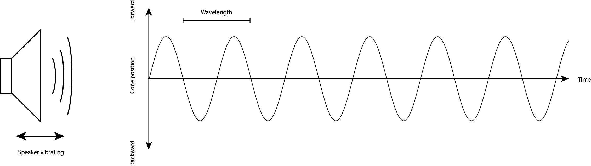
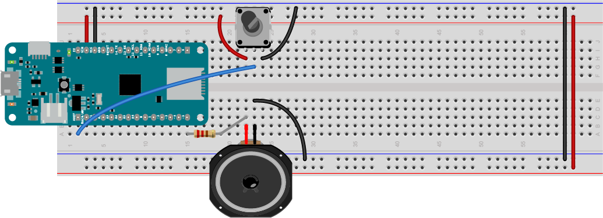
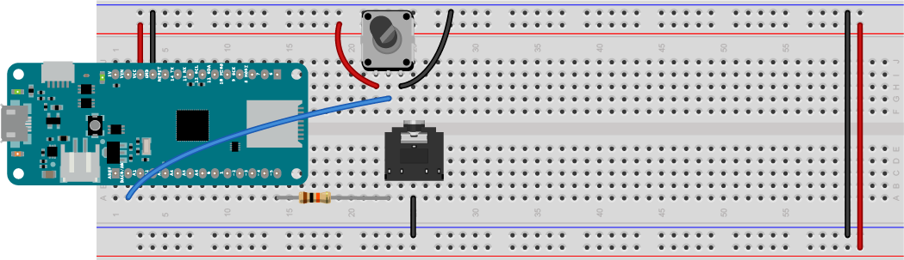

# The Basics of Making Sound

In order to use these examples, there are a few things you need to know. 

Sound is created by vibrations in air. When those vibrations get fast enough, above about 20 times a second, you hear them as a pitch. The number of vibrations per second is called the **frequency** and frequency is measured in Hertz (Hz). So 20 times a second is 20Hz. Humans can hear pitches from about 20Hz to about 20,000Hz, or 20 kiloHertz (kHz).

What vibrations are we talking about? A speaker can vibrate. The paper cone of the speaker moves forward, then backward, than back to its resting place many times a second. The length of time it takes to move from its resting place to one extreme, then to the other, then to its resting place again, is called the **wavelength** of the vibration. Sometimes it's also called the **period**. For example, if a speaker is vibrating at 20Hz, then it moves forward, backward, and back to rest in 1/20 of a second, or 0.05 seconds. 0.05 seconds is the period, or the wavelength, of the sound you're hearing. Figure 1 shows the speaker vibrating, and a graph of the speaker's movement. This graph is a **sine wave**. 



*Figure 1. When a speaker vibrates in air, it moves forward and backward in a sine wave pattern. The time it takes to move from rest to its forward position to its backward position and back to rest is called the wavelength or the period of the wave.*

A computer makes sound by sending pulses of electrical energy through a wire that's connected to the paper cone of a speaker. That wire is wrapped in a coil, and mounted inside a magnet. The electrical energy generates a magnetic field, and that field is either attracted to the magnet or repelled by it, depending on which direction the electrical energy is flowing. The magnetic energy moves the coil, and since the coil is attached to the cone, the speaker moves.

Arduino modules are simple computers called **microcontrollers**. They have input and output pins, and you can use one of those pins to vibrate a speaker.  To get started doing that, connect a speaker to your Arduino MKR Zero (or any of the MKR boards) as shown below

## Connecting A Speaker or Headphone Jack to the Arduino

Attach one end of a 220-ohm resistor to pin 5 of the MKR Zero. Attach the other end of the resistor to one of the empty rows on your breadboard. Next attach one wire of the speaker in that same row. Then attach the other wire of the speaker to the MKR Zero's ground (GND) pin. Figure 2 below shows what that would look like on a [solderless breadboard](https://itp.nyu.edu/physcomp/labs/labs-electronics/breadboard/)


*Figure 2. Speaker attached to pin 5 of a MKR Zero. The resistor limits the current to the speaker to protect it.*

You can also use headphones if you like. To do this, connect one end of a 10-kilohm resistor to pin 5 of the MKR Zero. Then connect the other end to one of the empty rows on your breadboard. Next attach the left or right inputs to your audio jack (usually the outside pins) in that same row. Then attach the audio jack's ground pin (usually the middle pin) to the MKR Zero's ground (GND) pin. Figure 3 below shows what that would look like on a solderless breadboard:


*Figure 3. Headphone jack attached to pin 5 of a MKR Zero. The resistor limits the current and lowers the voltage to the headphone jack to protect your headphones and your ears.*

## Making Sound With Electricity

An Arduino sketch changes the voltage of the output pins using a command called ``digitalWrite()``. If you set the voltage of the speaker pin alternately high and low, the speaker will vibrate. You can control the timing of these on and off pulses using the ``delay()`` and ``delayMicroseconds()`` commands. ``delay(1)`` stops your program for one thousanth of a second, or one millisecond. ``delayMicroseconds(1)`` stops it for one millionth of a second, or one microsecond. By controlling the timing on your pulses, you can make the speaker vibrate at a particular frequency. 

Make a new Arduino sketch by clicking the File menu and choosing New (ctrl-N or command-N (MacOS)). Save it with the name ``Beep``. First, make an integer constant to give pin 5 a name, speakerPin, like so:

````
const int speakerPin = 5;  // the pin number for the speaker
````

<u style="color: green;">Syntax note:</u> A **const** is a type of variable that doesn't change. You can use it to give names to numbers. An ``int`` is an integer variable type. So a ``const int`` is an integer that doesn't change

In the ``setup()`` function, set the speakerPin to be an output pin like so:

````
void setup() {
  // make the speaker pin an output:
  pinMode(speakerPin, OUTPUT);
}
````

<u style="color: green;">Syntax note:</u>: The ``pinMode()`` function configures a pin of the Arduino to be a digital input or an output. The parameters are the pin number (an int) and the state (INPUT or OUTPUT).

<u style="color: green;">Syntax note:</u>: Anything in ALL_CAPS is an alias in the program, usually a number that has been given a name. For example, INPUT is defined in the core of Arduino as 0, and OUTPUT is defined as 1.  You'll define a few of your own aliases in later exercises.

In the loop, start with a floating point integer variable (a decimal number) called ``frequency``, and set equal to 440. Then make an integer variable called ``period``, and set it to 1/frequency like so:

````
void loop() {
  // set the frequency in Hz:
  float frequency = 440;
  // set the period in microseconds:
  int period = (1 / frequency) * 1000000;
````

Next, turn the speaker on using the ``digitalWrite()`` command. When you've set the voltage high, delay for half the period. Then turn it off using ``digitalWrite()`` again, then delay for the second half of the period. That's the end of your loop:

````
 // turn the speaker on:
  digitalWrite(speakerPin, HIGH);
  // delay half the period:
  delayMicroseconds(period / 2);
  // turn the speaker off:
  digitalWrite(speakerPin, LOW);
  // delay half the period:
  delayMicroseconds(period / 2);
}
````
<u style="color: green;">Syntax note:</u>: ``digitalWrite()`` sets the voltage on a digital output pin. The parameters are the pin number (an int) and the pin state (an int, 1 or 0, aka HIGH or LOW).

Now you've got a complete sketch. Upload it to your board, and you should hear it beeping at 440 Hz, which is a middle A note. Do a little dance of celebration now.

Here is [the complete Beep sketch](https://github.com/tigoe/SoundExamples/blob/master/Tone_examples/Beep/Beep.ino).

## Varying the Pitch of A Sound

Now that you can get the microcontroller to play a pitch, it'd be more exciting if you could vary it. To do that, you'll need an input to your Arduino. 

### Adding an Analog Input
There are two kinds of inputs for microcontrollers, called digital inputs and analog inputs. [**Digital inputs**](https://itp.nyu.edu/physcomp/lessons/microcontrollers/digital-input-output/) can have only two possible states, on or off. A pushbutton or a switch are examples of digital input sensors. A digital input sensor changes the voltage on its input pin to either the highest voltage the microcontroller can handle, or the lowest. These are referred to as HIGH or LOW in code, or 1 or 0.

[**Analog inputs**](https://itp.nyu.edu/physcomp/lessons/microcontrollers/analog-input/) can have multiple possible states. A volume knob is an example of an analog input. An analog input sensor varies the voltage on its input pin between the highest voltage the microcontroller can handle, and the lowest. A circuit inside the microcontroller called an **analog-to-digital converter (ADC)** converts this changing voltage into a number in the microcontroller's memory. In the Arduino environment, analog inputs convert the voltage into a range of values from 0 to 1023. 

The volume knob mentioned earlier is actually an electronic component called a **potentiometer**. It can produce a variable resistance between its center pin and the two side pins. The two side pins are the ends of a fixed  resistor, 10-kilohm in this case, and the center pin is called the **wiper**. The wiper moves along the resistor, effectively dividing it in two to form two variable resistors. As one side gains resistance, the other side loses it. If you connect the side pins to voltage and ground, and the center pin to one of the Arduino's analog inputs, you can read the changing position of the knob in 1024 possible steps using the ``analogRead()`` command. 

<u style="color: green;">Syntax note:</u>: the ``analogRead()`` command reads the voltage on an analog input pin and returns it as a integer between 0 and 1023. Its parameter is the pin number you want to read (an int). The analog input pins are defined as A0 through A6 on the MKR boards, and A0 through A5 on the Uno.

Connect a potentiometer to your speaker or headphone circuit as shown in Figures 4 and 5.



*Figure 4. Speaker attached to pin 5 and potentiometer attached to pin A0. The potentiometer will be used to change the frequency of your sound.*



*Figure 5. headphone jack attached to pin 5 and potentiometer attached to pin A0. The potentiometer will be used to change the frequency of your sound.*

## Programming for the Potentiometer

Your sketch to vary the frequency will be similar to the previous one. Open a new Sketch in the Arduino IDE, and save it with the name ``BeepChange``. Set a constant for the speaker pin name and set the pin as an output just like you did in the previous sketch:

````
const int speakerPin = 5;  // the pin number for the speaker

void setup() {
  // make the speaker pin an output:
  pinMode(speakerPin, OUTPUT);
}
````

In the loop, start by making a variable called sensorValue to save the value from the potentiometer that's attached to pin A0, and read that value using the ``analogRead()`` command like so:

````
void loop() {
  // read the potentiometer:
  int sensorValue = analogRead(A0);
````

Next, use the [``map()``](https://www.arduino.cc/reference/en/language/functions/math/map/) command to map the sensors 0-1023 range to a range of frequencies. Use the range of a piano keyboard. The lowest note on a keyboard, A0 is 27.5 Hz, and the highest, C8, is 4186 Hz. You'll need a floating point integer variable to store the result from the ``map()`` command. Once you've got the frequency, get the period like you did before. Here are your next few lines:

````
  // map the potentiometer to a range
  // from A0 to C8 (27.5 Hz to 4186):
  float frequency = map(sensorValue, 0, 1023, 27.5, 4186);
  // set the period in microseconds:
  int period = (1 / frequency) * 1000000;
````
Finally, make the tone like you did in the last sketch:

````
// turn the speaker on:
  digitalWrite(speakerPin, HIGH);
  // delay half the period:
  delayMicroseconds(period / 2);
  // turn the speaker off:
  digitalWrite(speakerPin, LOW);
  // delay half the period:
  delayMicroseconds(period / 2);
}
````

Upload the sketch. When you turn the knob, you should hear the pitch of the speaker changing all the way from A0 to C8. 

Here is [the complete BeepChange sketch](https://github.com/tigoe/SoundExamples/blob/master/Tone_examples/BeepChange/BeepChange.ino).

Next, move on to the [Tone examples](tone.md).