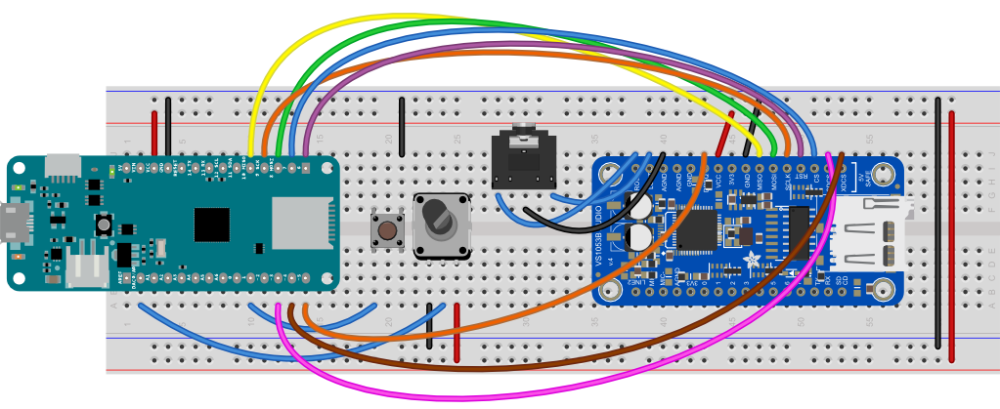

# The VS1053 Module as an MP3 player

The VS1053 module is a handy MIDI synth, and it can also play MP3 files from its SD card. Both Sparkfun and Adafruit make products with this  useful component. The relevant pins for using it as an MP3 player are described below, both for the Adafruit breakout module and the Sparkfun shield.

## VS1053 MP3 Mode Connections

MP3 mode is controlled via an SPI synchronous serial interface, as is the SD card. This mode uses the following pins. The [Adafruit VS1053 breakout module](https://www.adafruit.com/product/1381)'s pins are numbered in a U shape from top left to top right. The SD card is at the bottom of the module:

* Reset pin (RESET) - physical pin 20
* SPI MOSI - physical pin 22
* SPI MISO - physical pin 23
* SPI clock - physical pin 21
* SPI chip select pin (CS)  - physical pin 18
* Data/command select pin (XDCS) - physical pin 16
* SD card chip select pin (SDCS) - physical pin 17
* Data request (DREQ)- physical pin 27
* Right Audio Out (ROUT) - physical pin 32
* Left Audio Out (LOUT) - physical pin 31
* Analog Ground (AGND) - physical pin 30 

The [Adafruit VS1053 Featherwing](https://www.adafruit.com/product/3357) has a slightly different layout. See [its tutorial](https://learn.adafruit.com/adafruit-music-maker-featherwing/pinouts) for the details. It's designed to be used with Adafruit's Feather boards. 

The [Sparkfun MP3 Player shield](https://www.sparkfun.com/products/12660) is designed to be used with the Uno style boards. Its pinout follows the Arduino UNo footprint, and here are the relevant pins: 

* Reset pin (RESET) - Arduino Uno pin D8
* SPI MOSI - Arduino Uno pin D11
* SPI MISO - Arduino Uno pin D12
* SPI clock - Arduino Uno pin D13
* SPI chip select pin (CS)  - Arduino Uno pin D6
* Data/command select pin (DCS) - Arduino Uno pin D7
* SD card chip select pin (SDCS) - Arduino Uno pin D9
* Data request (DREQ)- Arduino Uno pin D2
* Right Audio Out (ROUT) - built into the stereo mini jack
* Left Audio Out (LOUT) - built into the stereo mini jack
* Analog Ground (AGND) - built into the stereo mini jack

### VS1053 Connected to a MKR Board

Figure 1 shows the Adafruit VS1053 breakout module connected to a MKR Zero. The MKR Zero is mounted the top of the breadboard as usual, and the VS1053 is mounted at the bottom. A stereo mini jack, a potentiometer, and a pushbutton are mounted in between. The board wiring connections are described below the image.



*Figure 1. MKR board connected to an Adafruit VS1053 module in MP3 mode*

The wiring connections  for the MKR board connected to the VS1053 module are as follows:

* VS1053 Reset pin (RESET) (physical pin 20) - connected to MKR pin D6 (physical pin 15)
* VS1053 SPI MOSI (physical pin 22) - connected to MKR pin D8 (physical pin 17)
* VS1053 SPI MISO (physical pin 23) - connected to MKR pin D10 (physical pin 19)
* VS1053 SPI clock (physical pin 21) - connected to MKR pin D9 (physical pin 18)
* VS1053 SPI chip select pin (CS)  (physical pin 18) - connected to MKR pin D7 (physical pin 16)
* VS1053 Data/command select pin (XDCS) (physical pin 16) - connected to MKR pin D4 (physical pin 13)
* VS1053 SD card chip select pin (SDCS) (physical pin 17) - connected to MKR pin D3 (physical pin 12)
* VS1053 Data request (DREQ)(physical pin 27) - connected to MKR pin D5 (physical pin 14)
* VS1053 Right Audio Out (ROUT)(physical pin 32) - connected to stereo mini jack right pin
* VS1053 Left Audio Out (LOUT) (physical pin 31) - connected to stereo mini jack left pin
* VS1053 Analog Ground (AGND) (physical pin 30) - connected to stereo mini jack center pin
* VS1053 VCC (physical pin 26) - connected to 3.3V voltage bus
* VS1053 GNC (physical pin 24) - connected to ground bus

One side of the pushbutton is connected to the ground bus. The other side is connected to the MKR's pin D1 (physical pin 10). 

The potentioneter's two sides are connected to the 3.3V voltage bus and ground, respectively. The center is connected to the MKR's analog in 0 (physical pin 2).

## Programming the Arduino for MP3 Playback

You can control the VS1053 from your  Arduino with the [button playback example](https://github.com/tigoe/SoundExamples/blob/master/VS1053_examples/VS1053_mp3_buttonPlayback/VS1053_mp3_buttonPlayback.ino). You'll need to add the Adafruit_VS1053 library using the Library Manager in the Arduino IDE. This library also works with the Sparkfun shield. Then the sketch goes as follows:

Start by adding the SPI, SD, and Adafruit MP3 control libraries for this module. Then set the pin numbers for the VS1053 control:

````
#include <SPI.h>
#include <SD.h>
#include <Adafruit_VS1053.h>


// the VS1053 chip and SD card are both SPI devices.
// Set their respective pins:

#define VS1053_RESET    6     // VS1053 reset pin
#define VS1053_CS       7     // VS1053 chip select pin 
#define VS1053_DCS      4     // VS1053 Data/command select pin 
#define CARDCS          3     // SD card chip select pin
#define VS1053_DREQ     5     // VS1053 Data request
````
The control pins will vary if you're usuing an Uno and the Sparkfun shield, or a Feather and the Featherwing. Change them accordingly if that's the case. 

Next set the pushbutton pin, and make a variable to track the change in its state:

````
const int buttonPin = 1;      // pin for the pushbutton
int lastButtonState = HIGH;   // previous state of the pushbutton
````

Then make an instance of the VS1053 library using the pins you set, and set a string to name the sound file you'll play:

````
// make an instance of the MP3 player library:
Adafruit_VS1053_FilePlayer mp3Player =
  Adafruit_VS1053_FilePlayer(VS1053_RESET, VS1053_CS, VS1053_DCS, VS1053_DREQ, CARDCS);

// sound file name must be 8 chars .3 chars:
const char soundFile[] = "SOUND001.MP3";
````

In the `setup()`, initialize serial communication for diagnostic purposes only, then set the pinMode of the pushbutton and the VS1053 reset, then reset the module:

````
void setup() {
  Serial.begin(9600);

  // set the pushbutton pin as an input, using internal pullups:
  pinMode(buttonPin, INPUT_PULLUP);
  
  // reset the VS1053 by taking reset low, then high:
  pinMode(VS1053_RESET, OUTPUT);
  digitalWrite(VS1053_RESET, LOW);
  delay(10);
  digitalWrite(VS1053_RESET, HIGH);
````

Next, initialize the MP3 player and the SD card:

````
  // initialize the MP3 player:
  if (!mp3Player.begin()) {
    Serial.println("VS1053 not responding. Check to see if the pin numbers are correct.");
    while (true); // stop
  }

  // initialize the SD card on the module:
  if (!SD.begin(CARDCS)) {
    Serial.println("SD failed, or not present");
    while (true);  // stop
  }
  ````
Next, set the output volume for the module, enable its fileplayer interrupt pin, and start playing the sound file. That's the end of the `setup()`: 
````
  // Set volume for left and right channels.
  // 0 = loudest, 100 = silent:
  mp3Player.setVolume(10, 10);
  
  // use the VS1053 interrrupt pin so it can
  // let you know when it's ready for commands.
  mp3Player.useInterrupt(VS1053_FILEPLAYER_PIN_INT);

  // play file:
  mp3Player.startPlayingFile(soundFile);
  Serial.println("playing");
}
````

In the `loop()`, read the potentiometer and map its value to a range from 100 to 0 so you can use it to set the playback dynamically:

````
void loop() {
  // read a potentiometer (0-1023 readings) and
  // map to a range from 100 to 0:
  int loudness = map(analogRead(A0), 0, 1023, 100, 0);
  // set the volume:
  mp3Player.setVolume(loudness, loudness);
````

Next, restart the file if it's stopped:

````
// loop the player:
  if (mp3Player.stopped()) {
    mp3Player.startPlayingFile(soundFile);
  }
````
Then read the push button and look for a state change. If the state changes and the button's pressed, toggle the play/pause state of the MP3 player. That's the end of the `loop()`:
````
 // read a pushbutton for play/pause:
  int buttonState = digitalRead(buttonPin);
  // if the button has changed:
  if (buttonState != lastButtonState) {
    // if the button is low:
    if (buttonState == LOW) {
      // switch play/pause state:
      if (mp3Player.paused()) {
        mp3Player.pausePlaying(false);
      } else {
        mp3Player.pausePlaying(true);
      }
    }
  }
  // save current button state for comparison next time:
  lastButtonState = buttonState;
}
````

When you upload this sketch to your MKR board. 

<u style="color: red;">WARNING:</u> The MKR Zero's built-in SD card shield will prevent you from controlling an external SD Card module like this one. To get around this, you can choose the MKR 1000 or MKR 1010 as your board type when compiling and uploading this sketch.

Finally, format a microSD card as FAT16 or FAT32 and put an MP3 file on it called SOUND001.MP3. Insert it in the module, then restart your Arduino. The file should play, and you can change its volume and play/pause with the pot and the pushbutton. Here's a link to  the [complete sketch](https://github.com/tigoe/SoundExamples/blob/master/VS1053_examples/VS1053_mp3_buttonPlayback/VS1053_mp3_buttonPlayback.ino).

This sketch should run on any Arduino-compatible board if you change the pin numbers to match the particular VS1053 module or shield you are using. 